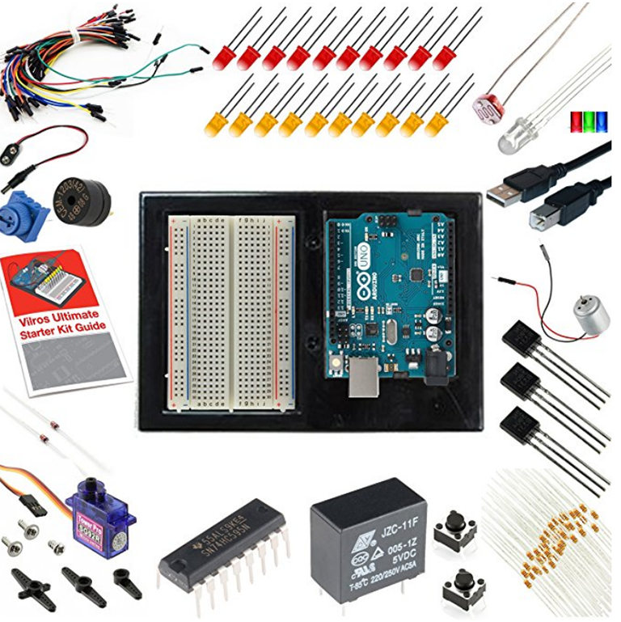

# Overview

Notes on Arduino technology.

# References

tbd

## YouTube Refences

tbd

## My Other Notes

### Notes in this repository

* [ElectronicNotes](https://github.com/GitLeeRepo/ElectronicsNotes/blob/master/ElectronicsNotes.md#overview)

### Notes in Other Repositories

* [NotesGuidelines](https://github.com/GitLeeRepo/NotesGuidlines/blob/master/NotesGuidelines.md#overview)

# Contents

tbd

# Concepts and Terminology

* **Atmel Corporation** was a designer and manufacturer of semiconductors before being acquired by Microchip Technology in 2016. It was founded in 1984. The company focuses on embedded systems built around microcontrollers. Its products include microcontrollers (8-bit AVR, 32-bit AVR, 32-bit ARM-based, automotive grade, and 8-bit Intel 8051 derivatives) radio frequency (RF) devices including Wi-Fi, EEPROM, and flash memory devices, symmetric and asymmetric security chips, touch sensors and controllers, and application-specific products. Atmel supplies its devices as standard products, application-specific integrated circuits (ASICs), or application-specific standard product (ASSPs) depending on the requirements of its customers. ([Wikipedia](https://en.wikipedia.org/wiki/Atmel))

tbd

# My Equipment

## Arduino Uno Rev3 Board

[Vilros Arduino Uno Ultimate Starter Kit + LCD Module](https://www.amazon.com/gp/product/B00HI0RYJK/ref=oh_aui_search_detailpage?ie=UTF8&psc=1)

**Kit Contents**

* 1X Arduino Uno R3 
* 1x 16x2 LCD Module With Presoldered pinheaders 
* 1X Arduino & Breadboard Holder 
* 1X Bread Board 
* 1X Shift Register 
* 2X 2N3904Transistors 
* 2X 1N4148 Diodes 
* 1X DC Motor with wires 
* 1X Small Servo 
* 1X 5V Relay 
* 1X TMP36 Temp Sensor 
* 1X 6' USB Cable 
* 65X Jumper Wires 
* 1X Photocell 
* 1X Tri-color LED 
* 10X Red LED 
* 10X yellow LED 
* 1X 10K Trimpot 
* 1X Piezo Buzzer 
* 2X Big 12mm Buttons 
* 45X 330 Resistors 
* 45X 10K Resistors 

### Arduino Uno R3 Description from SparkFun

 **Arduino Uno R3**  In addition to all the features of the previous board, the Uno now uses an **ATmega16U2** instead of the 8U2 found on the Uno (or the FTDI found on previous generations). This allows for faster transfer rates and more memory

 ### ATmega328P

 Refer to:

 * [Wikipedia](https://en.wikipedia.org/wiki/ATmega328)

 Mine is an **ATmega328P in 28-pin narrow dual in-line package (DIP-28N)**

 The **ATmega328** is a single-chip microcontroller created by **Atmel** in the **megaAVR** family (later **Microchip Technology acquired Atmel in 2016**). It has a modified Harvard architecture **8-bit RISC processor core**.

 #### ATmega32P Specifications

* CPU type -- 8-bit AVR
* Performance -- 20 MIPS at 20 MHz[2]
* Flash memory --32 kB
* SRAM -- 2 kB
* EEPROM -- 1 kB
* Pin count -- 28 or 32 pin: PDIP-28, MLF-28, TQFP-32, MLF-32[2]
* Maximum operating frequency -- 20 MHz
* Number of touch channels -- 16
* Hardware QTouch Acquisition -- No
* Maximum I/O pins -- 23
* External interrupts -- 2
* USB Interface -- No
* USB Speed –- NA
