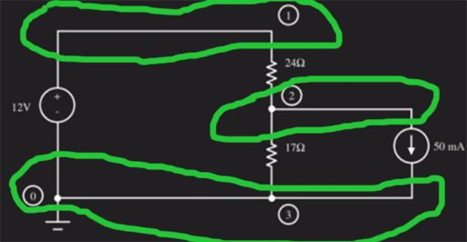

# Overview

Notes on various Circuit Simulators

# References

* [LTspice]
* [CircuitSimulator Java App](https://www.falstad.com/circuit/) -- this is web based.  I have an older executable jar file of this.  The older local version is in the [repository](https://github.com/GitLeeRepo/ElectronicsNotes/tree/master/Electronics/Circuit%20Simulator)


## YouTube Refences

* [LTspice Tutorial](https://www.youtube.com/watch?v=FEGT5dUpdrc) -- EEVblog

## My Other Notes

### Notes in this repository

* [ElectronicNotes](https://github.com/GitLeeRepo/ElectronicsNotes/blob/master/ElectronicsNotes.md#overview)

### Notes in Other Repositories

* [NotesGuidelines](https://github.com/GitLeeRepo/NotesGuidlines/blob/master/NotesGuidelines.md#overview)

# Contents

tbd

# Concepts and Terminology

* **Directives** -- **Spice directives** are what tell **SPICE** what to do, such as **.op**, which is the **DC op pnt** simulation option.

* **Network** --
* **Node** --

# SPICE

**SPICE** is an acronym for **Simulation Program with Integrated Circuit Emphasis**.  It was developed to allow the **simulation** of **integrated circuits**, which really weren't possible to do on a **bread board**. It is traditionally a **command line** application.  It was developed back in the **70s**.

It is **used** as the **language** for many **GUI Applications**:

* Many **CAD** and other **engineering applications** use it for **simulating circuits**.
* **Entire micro controllers** are designed in **products** that use the **SPICE language**

References:

* [Wikipedia](https://en.wikipedia.org/wiki/SPICE)
* [Berkley Reference Manual](http://www.eecg.toronto.edu/~kphang/teaching/spice/index.html)
* [Spice Basics](http://www.ecircuitcenter.com/Basics.htm)

### SPICE Language

#### Nodes

**Nodes** provide a **contextual relationship** between **different components**.  **Nodes** are where **connections** come **together**.  A **node** provides an **identifier** which the **component references** for **one of it connections**.

* **Ground** is typically **node 0**



The **nodes** are circled in **green** above.  Note that the **0** and **3** **nodes** are the **same**, which is perfectly fine since they are just **labels** and can refer to the same thing.

#### Example Commands

```
* The DC voltage source from node 1 to 0 is 12V
V1 1 0 DC 12.0V

* The current load from node 2 to 0 is 50 mA
iload 2 0 DC 50.0mA

* Resistor R1 from node 1 to 2 is 24 ohm
R1 1 2 24.0

* We want a DC solution .op reiterates this
* since it solves the solution for DC OP points
.OP

* The DC command instructs SPICE to step/sweep the voltage
* so we can print values with .PRINT
.DC V1 I1 I2 1:

* Print node voltages
.PRINT DC V(1), V(2)

* Print the current through R1 and R2
.PRINT DC I(R1), I(R2)

* End the code
.END
```


# LTspice

**LTspice** is a **circuit simulator** based on the **SPICE engine**, which has been around since the **70s**.  

**SPICE** is an open source analog electronic circuit simulator. **SPICE** is an acronym for **Simulation Program with Integrated Circuit Emphasis**.  It was developed to allow the **simulation** of **integrated circuits**, which really weren't possible to do on a **bread board**. It is traditionally a **command line** application.

## Keyboard and Mouse

### Keystrokes

* **Esc** -- release the **tool** you have selected.  You can then use your **mouse cursor** to **move the diagram**
* **Ctl+R** -- **rotate** the component.

### Mouse

* **Right+click** -- select the **component** or **node** properties
* **Left+click+drag** -- **move** the **diagram** around the screen.

## Components

Click on the **Components icon** on the **toolbar**.

## Component Units and Scales

### Units of measure

* **resistance** is in **ohms**.
* **capacitance** is in **farads**
* **inductance** will be in **henrys**
* **power** will be in **watts**

### Abbreviated scales

Note: these are **not case-sensitive**

* **K** -- **kilo** -- E+3
* **M** -- **milli** -- E-3
* **MEG** -- **mega** -- E+6
* **U** -- **micro** -- E-6
* **G** -- **giga** -- E+9
* **N** -- **nano** -- E-9
* **T** -- **terra** -- E+12
* **P** -- **pico** -- E-12
* **F** -- **femto** -- E-15

## Spice Directives

**Spice directives** are what tell **SPICE** what to do.

### Simulation Type Directives

* **Transient** -- the **most common**.  Similar to the typical **oscilloscope wave forms**.  For **simpler DC circuits** you may want to use **DC op pnt** instead.
* **AC Analysis** -- allows you to do **AC circuit sweeps** of your **circuit**.
* **DC Sweeps** -- perform various **DC sweeps** 
* **Noise** -- **noise analysis**
* **DC Transfer**
* **DC op pnt** -- **(.op)** -- the **simplest bare bone simulation** you can do.  Good for **simple DC circuits**.  It will display a **list** of **voltages** and **current** at various **op points**.

### Voltage Source

Click on the **Components icon** on the **toolbar** and select **voltage**.

By **default** it is a **DC voltage source**, but if you click on the **Advanced** button you can select **AC voltage** properties, along with various **function generation options**, such as **sine** and **pulse** waves.

## Measuring Voltages across Resistors

* **LTSpice** doesn't supply the **multimeter


## Things to watch out for

* If your result shows **negative current** where you are expecting **positive**, then you probably have the **component** positioned **backwards**.

# CircuitSimulator

* [CircuitSimulator Java App](https://www.falstad.com/circuit/) -- this is web based.  I have an older executable jar file of this.  The older local version is in the [repository](https://github.com/GitLeeRepo/ElectronicsNotes/tree/master/Electronics/Circuit%20Simulator)
