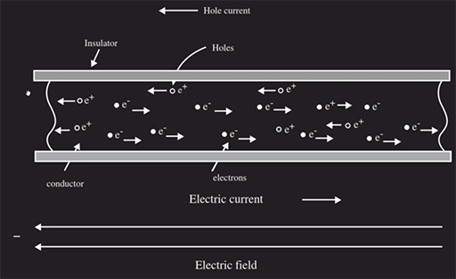

# Overview

Notes on electronics

# References

tbd

## Udemy

* [Crash Course Electronics and PCB Design](https://www.udemy.com/crash-course-electronics-and-pcb-design/learn/v4/overview)

## YouTube Refences

tbd

## My Other Notes

### Notes in this repository

* [GreatCoursesNotes](https://github.com/GitLeeRepo/ElectronicsNotes/blob/master/GreatCoursesNotes.md#overview)

### Notes in Other Repositories

* [NotesGuidelines](https://github.com/GitLeeRepo/NotesGuidlines/blob/master/NotesGuidelines.md#overview)

# Table of Contents

tbd

# Concepts and Terminology

* **Analog Electronics** -- involves **smoothly varying signals**.  **Signals** that can take on **varying voltages** or other characteristics. On a **scope** they are represented by **sine waves** and other **continuously varying wave types**.
* **CMOS chip** -- **Complimentary Metal Oxide Semiconductor** -- an **Integrated Circuit package**
* **Conductors** -- carry **electrical charge**.  They are made of materials such as **copper**, **gold**, **silver**, and **aluminum**.  These materials have **electrons** that are **loosely** bound to the **outer shell (valence shell)** of their **atoms**, so those **electrons** can be easily moved as **current**, which is pushed by a **voltage** force.
* **Conventional Current** -- refers to the **flow of holes** along a **conductor** from **positive to negative**.  This contrasts with **electron current** which refers to the flow of **electrons** in the **opposite direction** from **negative to positive**.  Generally, by convention, when we are referring to **current** in **electronics we are referring to **conventional current**.
* **Current** -- in **electronics** it is generally referring to **conventional current** in which the **holes** flow from **positive** to **negative**.  It is **measured** in **amperes**.  Refer to **conventional current**, **electron current** and **holes** for more details.
* **Digital Electronics** -- involves a **fixed voltage** that varies between **on/off** states.  On a **scope** they are represented by **square waves** that are either **on** or **off**.  In reality, **digital electronics** is built on **analog electronics** it is just a **model** that sits on top of it.
* **Electron Current** -- refers to the **flow of electrons** along a **conductor** from **negative to positive**.  This contrasts with **conventional current** which refers to the flow of **holes** in the **opposite direction** from **positive to negative**.  Generally, by convention, when we are referring to **current** in **electronics we are referring to **conventional current**.
* **EPROM** -- **Erasable Programmable Read Only Memory**
* **Holes** -- create when an **electron** in a **conductor** moves to the **next atom**.  If the **current** is viewed as moving from **positive to negative**, say from **left to right**, the **holes** move in the **opposite** direction, from **right to left**.  The flow of **electrons** is referred to as **electron current** with the flow of the **holes** referred to as **conventional current**.
* **Insulators** -- **resist** **electrical charge**.  They are made of materials whose **electrons** are **tightly bound** to their **outer shell (valence shell)** and don't flow easily from on **atom** to the next.
* **TTL chip** -- **Transistor Transistor Logic**

# Digital and Analog Electronics

## Analog Electronics

### Types of parts

* **resistors** --  **resists current**, **drops voltages**
* **capacitors** -- **stores electrical charge**
* **inductors/coils** -- **store/transfer electromagnetic energy**
* **diodes** -- a **semi-conductor device** that allows **current to flow in one direction only**
* **transistors** -- a **semi-conductor device** that is used as **amplifiers** and **switches**
* **batteries** -- **source** of electrical **current** / **voltage generators**
* **wires** -- used as **conductors** so that electrical **current** and **signals** flow from on **electrical element to another**.

## Digital Electronics

* **Digital electronics** is a **two state system** in which the state is either **on** or **off**.

* Many **digital systems** are based on a **fixed voltage** that is either **on** or **off**, with the **5V** system being the **most common**.  In a **5V system** **zero volts** represents **digital zero** and **5V** represents **digital one**. **3.3V** and **1.8V** are also **common**.

* **Digital signals** are represented by **square waves** on a **oscilloscope**. 

* **Analog to Digital converters** are used to **convert analog signals** to **digital**.  **Digital to Analog converts** do the reverse.  There is a certain **level of errors** that are going to occur, but in a well designed system they are generally not noticeably.  These errors occur both during **conversion** and **compression/decompression**.

### Type of Digital Parts

* **Integrated Circuits** -- for the **DIP (Duel Inline Package**), which has **pins** that go through **hole** in the **circuit board**, the **top** is typically marked with an **indentation**.  The **power pin** is typically on the **upper right**.  The **ground** is typically on the **bottom left**.  **Pin 1** is on the **top left** with **pin 2** being the next one on the **left**, and then wrapping around to the **bottom right** once the **bottom left** is reached, continuing to the **top right** for the **highest numbered pin**, i.e., they are counted in a **counter-clockwise** direction.

* **Micro Controlers** -- are **little computers** on a **chip**.  The **PIC family** of **chips** are an example, among many others.

* **And Gates**

* **Inverter Gates**

# Units of Measure

## Basic SI Units of Measure

Quantity   | Name      | Symbol | Fundamental Units
-----------|-----------|--------|----------------------
Time       | Second    | s      | NA
Length     | Meter     | m      | NA
Mass       | Kilogram  | kg     | NA
Force      | Newton    | N      | 1kg*m/s^2
Charge     | Coulomb   | C      | 6.24x10^18 electrons
Energy     | Joule     | J      | 1N*m
Current    | Ampere    | A      | 1C/s
Voltage    | Volt      | V      | 1J/C
Power      | Watt      | W      | 1J/s

## Prefixes in SI System

Symbol | Prefix  | Scaling Factor
a      | atto    | 10^-18
f      | femto   | 10^-15
p      | pico    | 10^-12
n      | nano    | 10^-9
u      | micro   | 10^-6
m      | milli   | 10^-3
k      | kilo    | 10^3
M      | mega    | 10^6
G      | giga    | 10^9
T      | tera    | 10^12
P      | peta    | 10^15
E      | exa     | 10^18

# Calculations

The variables represent:

* **P is power in Watts**
* **I is current in Amperes**
* **V is voltage in Volts**
* **R is resistance in Ohms**

## Ohm's Law

* **I = V/R**
* **V = IR**
* **R = V/I**

## Other Calculations

* **P = VI**

# Current

* **Current** is defined as the **amount of charge q(electrons)** that passes a **fixed point** as a **function of time**. Mathematically, **current** is **equal to the amount of charge per unit of time**.  The equation is **i = dq/dt**.

* **Current** -- in **electronics** it is generally referring to **conventional current** in which the **holes** flow from **positive** to **negative**.  It is **measured** in **amperes**.  Refer to **conventional current**, **electron current** and **holes** for more details.

* **Conventional Current** -- refers to the **flow of holes** along a **conductor** from **positive to negative**.  This contrasts with **electron current** which refers to the flow of **electrons** in the **opposite direction** from **negative to positive**.  Generally, by convention, when we are referring to **current** in **electronics we are referring to **conventional current**.

* **Electron Current** -- refers to the **flow of electrons** along a **conductor** from **negative to positive**.  This contrasts with **conventional current** which refers to the flow of **holes** in the **opposite direction** from **positive to negative**.  Generally, by convention, when we are referring to **current** in **electronics we are referring to **conventional current**.

* **Holes** -- create when an **electron** in a **conductor** moves to the **next atom**.  If the **current** is viewed as moving from **positive to negative**, say from **left to right**, the **holes** move in the **opposite** direction, from **right to left**.  The flow of **electrons** is referred to as **electron current** with the flow of the **holes** referred to as **conventional current**.

# Voltage

* **Voltage** is what helps us to **move the charge** through a **conductor** by using **pressure/force**.

* The **difference** between the **charge** at the **source** and at the **ground** is the **potential energy (U)** which is the **basis of voltage**.

* **Voltage mathematical definition: V=U/q0**, where **U** is the **potential energy in joules** and **q0** is the **charge in coulombs**.

* This equation results in **1V = 1J/1C**, where **J = Joules** and **C = Coulombs**

## Generation of Voltage

There are a number of ways to **generate voltage**, but most are based on either **chemicals**, **magnetic fields**, or **photo-electric effect**.

### Batteries

* **Chemical Batteries** are devices that use **chemicals (wet or dry)** to **create an accumulation of charge** and hence a **voltage**.

* The **positive** side of the **battery** is the **Anode**.

* The **negative** side of the **battery** is the **Cathode**.

* The **amount** of **charge** in a **battery** is often on the **label**.  For example, a **1.5V (actual 1.2V) Ni-MH battery** might show **2400mAh**, which means it can **supply 2400mA** for **one hour**.  This is **not** a very **accurate** way of representing the amount stored, since if you drained it by **2400mA** it would become **ineffective before one hour**, because it does **not maintain the full charge** over time .  A more accurate way would be to use **watt/hours** which accounts for the **drop in voltage over time**.

* The **amount of energy stored** is **proportional to the size** of the **battery**.  This  is why a **AAA battery** does **not** hold as much as much **charge** as a **AA** battery.  While a **1.2V Ni-MH AA battery** might have **2400mAh** and equivalent **AAA battery** might only have **800mAh**.

* **9V rectangular batteries**, which have the **two connectors** at the **top**, are actually made up of **6 1.5V cells wired in series** to produce the **9V**.

* **Batteries** have an **internal resistor** that supplies a **small amount of resistance**, which prevents it from being an **ideal battery**. When you **measure** the **voltage** on a **meter** it is **unloaded**, which means there is **very little current**, since the **current** is proportional to the **load/resistance**.  So because the **battery** only has a **very small amount** of **resistance** the **voltage** will **drop very little** when the **meter** is connected, so you are getting a **fairly accurate approximation of the ideal voltage**.

* If you **measure** the **current** directly between the **leads** of a **1.5V battery**, you are going to get a **high current** (in the **5A to 9A** range) for a **short time** and then the **current** is going to **start dropping fairly rapidly** as it **heats up** causing **more resistance**.  If you leave it connected for to long you will eventually **damage the battery**.

# Semiconductors

* **Semiconductors** are **neither good conductors** or **good insulators**, they are **neutral**. 

* **Doping agents** are **atoms** that introduced to make it **good** at either **conducting** or **insulating**.

* **Phosphorus** a **N-type dopant** is added, which has **5 electrons** compared to the **4 electrons** of the **silicon** in their **valence shells**.  This causes the **overall charge** to become **slightly negative**.  This creates an **N-type semiconductor**

* **Boron** a **P-type dopant** is added, which has **3 electrons** compared to the **4 electrons** of **silicon** in their **valence shells**.  This causes the **overall charge** to become **slightly positive**. This creates an **P-type semiconductor**

## Semiconductor Materials

* **Silicon (Si)** -- has **4 electrons** in its **valence shell** when it is **neutral**
* **Born (B)** -- has **3 electrons** in its **valence shell** and is used as a **P-type dopant**
* **Phosphorus (P)** has **5 electrons** in its **valence shell** and is used as a **N-type dopant**

## Devices and Their Approximate Current Needs

Device/System               | Average Current Drain
----------------------------|----------------------
Single Gate in a uProcessor | 10nA
Single Gate in a TTL Chip   | 5mA
Light Emitting Diode        | 20mA
Digital TTL Chip            | 30mA
LCD Calculator              | 50mA
27" TV                      | 2A
Personal Computer           | 5A
Hair Dryer                  | 10A
