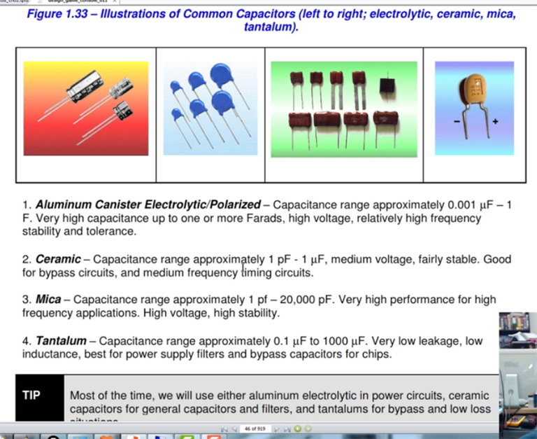

# Overview

Notes on electronics

# References

## Suppliers

* [SparkFun](https://www.sparkfun.com/)
* [Mouser](https://www.mouser.com/)
* [Jameco](https://www.jameco.com/)

## Udemy

* [Crash Course Electronics and PCB Design](https://www.udemy.com/crash-course-electronics-and-pcb-design/learn/v4/overview)

## YouTube Refences

tbd

## My Other Notes

### Notes in this repository

* [GreatCoursesNotes](https://github.com/GitLeeRepo/ElectronicsNotes/blob/master/GreatCoursesNotes.md#overview)
* [CircuitSimulators](https://github.com/GitLeeRepo/ElectronicsNotes/blob/master/CircuitSimulators.md#overview)
* [EquipmentNotes](https://github.com/GitLeeRepo/ElectronicsNotes/blob/master/EquipmentNotes.md#overview)
* [PartsNotes](https://github.com/GitLeeRepo/ElectronicsNotes/blob/master/PartsNotes.md#overview)

### Notes in Other Repositories

* [NotesGuidelines](https://github.com/GitLeeRepo/NotesGuidlines/blob/master/NotesGuidelines.md#overview)

# Table of Contents

tbd

# Concepts and Terminology

* **Analog Electronics** -- involves **smoothly varying signals**.  **Signals** that can take on **varying voltages** or other characteristics. On a **scope** they are represented by **sine waves** and other **continuously varying wave types**.

* **CMOS chip** -- **Complimentary Metal Oxide Semiconductor** -- an **Integrated Circuit package**

* **Conductors** -- carry **electrical charge**.  They are made of materials such as **copper**, **gold**, **silver**, and **aluminum**.  These materials have **electrons** that are **loosely** bound to the **outer shell (valence shell)** of their **atoms**, so those **electrons** can be easily moved as **current**, which is pushed by a **voltage** force.

* **Conventional Current** -- refers to the **flow of holes** along a **conductor** from **positive to negative**.  This contrasts with **electron current** which refers to the flow of **electrons** in the **opposite direction** from **negative to positive**.  Generally, by convention, when we are referring to **current** in **electronics we are referring to **conventional current**.

* **Current** -- in **electronics** it is generally referring to **conventional current** in which the **holes** flow from **positive** to **negative**.  It is **measured** in **amperes**.  Refer to **conventional current**, **electron current** and **holes** for more details.

* **Current Source** -- A **current source** is an electronic circuit that **delivers or absorbs an electric current** which is **independent of the voltage** across it.  There are **two types**. An **independent current source (or sink)** delivers a **constant current**. A **dependent current source** delivers a current which is **proportional** to some other **voltage** or **current** in the circuit. **Current-stable nonlinear implementation** is implemented by **active electronic components** (**transistors**) having **current-stable nonlinear output** characteristic when driven by **steady input quantity (current or voltage)**. These circuits behave as **dynamic resistors changing their present resistance to compensate current variations**. For example, if the **load increases its resistance**, the **transistor decreases** its present **output resistance** (and vice versa) to keep up a **constant total resistance in the circuit**. ([Wikipedia](https://en.wikipedia.org/wiki/Current_source))

* **Digital Electronics** -- involves a **fixed voltage** that varies between **on/off** states.  On a **scope** they are represented by **square waves** that are either **on** or **off**.  In reality, **digital electronics** is built on **analog electronics** it is just a **model** that sits on top of it.

* **Electron Current** -- refers to the **flow of electrons** along a **conductor** from **negative to positive**.  This contrasts with **conventional current** which refers to the flow of **holes** in the **opposite direction** from **positive to negative**.  Generally, by convention, when we are referring to **current** in **electronics we are referring to **conventional current**.

* **EPROM** -- **Erasable Programmable Read Only Memory**

* **Gain** -- a measure of the ability of a **two-port circuit (often an amplifier)** to **increase the power or amplitude of a signal** from the **input to the output port** by **adding energy** converted from some **power supply** to the **signal**. It is usually defined as the **mean ratio** of the **signal amplitude** or **power** at the **output port** to the amplitude or power at the input port. It is often expressed using the **logarithmic decibel (dB) units** ("dB gain"). A **gain greater than one** (greater than zero dB), that is **amplification**, is the defining property of an **active component** or circuit, while a **passive circuit** will have a **gain of less than one**.

* **Holes** -- create when an **electron** in a **conductor** moves to the **next atom**.  If the **current** is viewed as moving from **positive to negative**, say from **left to right**, the **holes** move in the **opposite** direction, from **right to left**.  The flow of **electrons** is referred to as **electron current** with the flow of the **holes** referred to as **conventional current**.

* **Insulators** -- **resist** **electrical charge**.  They are made of materials whose **electrons** are **tightly bound** to their **outer shell (valence shell)** and don't flow easily from on **atom** to the next.

* **Line level** -- the specified **strength** of an **audio signal** used to **transmit analog sound** between **audio components** such as CD and DVD players, television sets, audio amplifiers, and mixing consoles.  **Line level** it is **between weaker audio signals sources** and **stronger signals**, such **loudspeakers**. ([Wikipedia/edited](https://en.wikipedia.org/wiki/Line_level))

* **Op-amp** -- **Operational Amplifier** -- have **two inputs**, ""inverting (-)** and **non-inverting (+)**, along with **one output**.  The **polarity** of the **signal** is **reversed** between the **inverting input** and the **output**.  The **signal** at the **non-inverting input retains its polarity*** at the **output**. (paraphrasing from "Timer, Op Amp, & Optoelectronic Circuits & Projects** by Forrest M. Mims III)

* **Pitch** -- the **distance** between **component pins**.

* **TTL chip** -- **Transistor Transistor Logic**

# Digital and Analog Electronics

## Analog Electronics

### Types of parts

* **resistors** --  **resists current**, **drops voltages**
* **capacitors** -- **stores electrical charge**
* **inductors/coils** -- **store/transfer electromagnetic energy**
* **diodes** -- a **semi-conductor device** that allows **current to flow in one direction only**
* **transistors** -- a **semi-conductor device** that is used as **amplifiers** and **switches**
* **batteries** -- **source** of electrical **current** / **voltage generators**
* **wires** -- used as **conductors** so that electrical **current** and **signals** flow from on **electrical element to another**.

## Digital Electronics

* **Digital electronics** is a **two state system** in which the state is either **on** or **off**.

* Many **digital systems** are based on a **fixed voltage** that is either **on** or **off**, with the **5V** system being the **most common**.  In a **5V system** **zero volts** represents **digital zero** and **5V** represents **digital one**. **3.3V** and **1.8V** are also **common**.

* **Digital signals** are represented by **square waves** on a **oscilloscope**. 

* **Analog to Digital converters** are used to **convert analog signals** to **digital**.  **Digital to Analog converts** do the reverse.  There is a certain **level of errors** that are going to occur, but in a well designed system they are generally not noticeably.  These errors occur both during **conversion** and **compression/decompression**.

### Type of Digital Parts

* **Integrated Circuits** -- for the **DIP (Duel Inline Package**), which has **pins** that go through **hole** in the **circuit board**, the **top** is typically marked with an **indentation**.  The **power pin** is typically on the **upper right**.  The **ground** is typically on the **bottom left**.  **Pin 1** is on the **top left** with **pin 2** being the next one on the **left**, and then wrapping around to the **bottom right** once the **bottom left** is reached, continuing to the **top right** for the **highest numbered pin**, i.e., they are counted in a **counter-clockwise** direction.

* **Micro Controlers** -- are **little computers** on a **chip**.  The **PIC family** of **chips** are an example, among many others.

* **And Gates**

* **Inverter Gates**

# Units of Measure

## Basic SI Units of Measure

Quantity   | Name      | Symbol | Fundamental Units
-----------|-----------|--------|----------------------
Time       | Second    | s      | NA
Length     | Meter     | m      | NA
Mass       | Kilogram  | kg     | NA
Force      | Newton    | N      | 1kg*m/s^2
Charge     | Coulomb   | C      | 6.24x10^18 electrons
Energy     | Joule     | J      | 1N*m
Current    | Ampere    | A      | 1C/s
Voltage    | Volt      | V      | 1J/C
Power      | Watt      | W      | 1J/s

## Prefixes in SI System

Symbol | Prefix  | Scaling Factor
a      | atto    | 10^-18
f      | femto   | 10^-15
p      | pico    | 10^-12
n      | nano    | 10^-9
u      | micro   | 10^-6
m      | milli   | 10^-3
k      | kilo    | 10^3
M      | mega    | 10^6
G      | giga    | 10^9
T      | tera    | 10^12
P      | peta    | 10^15
E      | exa     | 10^18

# Calculations

The variables represent:

* **P is power in Watts**
* **I is current in Amperes**
* **V is voltage in Volts**
* **R is resistance in Ohms**

## Ohm's Law

* **V = IR**
* **I = V/R**
* **R = V/I**

### Current Calculation in a Series Circuit

When calculating **current** in a circuit with **multiple resistors** that are **in series**, simply **add all resistances** and then apply **Ohm's Law** to determine your **current**, **I = V/R**.

## Power Calculations

**Power** is **work** which is **energy expended**.

* **P = VI** -- **voltage times current equals power**.  This is **true** for **DC** when everything is **in phase**.
* **P = (V^2)/R** -- using **substitution** from **Ohm's Law** where  **(V^2)/R** comes from **I = V/R** so **P = V\*V/R = (V^2)/R**.  Note this is **important** because **power** is not **proportional** to voltage, but to **voltage squared**, which is why it is **important** to **lower voltage** in systems.  Over the years **voltage** in circuits went from typically being **12V** to **5V**, **3.3V**, **1.8V**, **1.5V**, and **1.2V** systems.

### Definition of Power

* **dW = V \* dQ/dt** -- the **change** in **power** is **equal** to the **change** in **current** per the **Unit time**. This is equivalent to the **P = VI** derivation.

# Current

* **Current** is defined as the **amount of charge q(electrons)** that passes a **fixed point** as a **function of time**. Mathematically, **current** is **equal to the amount of charge per unit of time**.  The equation is **i = dq/dt**.

* **Current** -- in **electronics** it is generally referring to **conventional current** in which the **holes** flow from **positive** to **negative**.  It is **measured** in **amperes**.  Refer to **conventional current**, **electron current** and **holes** for more details.

* **Conventional Current** -- refers to the **flow of holes** along a **conductor** from **positive to negative**.  This contrasts with **electron current** which refers to the flow of **electrons** in the **opposite direction** from **negative to positive**.  Generally, by convention, when we are referring to **current** in **electronics we are referring to **conventional current**.

* **Electron Current** -- refers to the **flow of electrons** along a **conductor** from **negative to positive**.  This contrasts with **conventional current** which refers to the flow of **holes** in the **opposite direction** from **positive to negative**.  Generally, by convention, when we are referring to **current** in **electronics we are referring to **conventional current**.

* **Holes** -- create when an **electron** in a **conductor** moves to the **next atom**.  If the **current** is viewed as moving from **positive to negative**, say from **left to right**, the **holes** move in the **opposite** direction, from **right to left**.  The flow of **electrons** is referred to as **electron current** with the flow of the **holes** referred to as **conventional current**.

## Current Sourcing and Sinking

From: [current-sourcing-sinking](https://startingelectronics.org/articles/current-sourcing-sinking/)

* A **current source** is when a **load** is **connected to a device** so that the **device supplies current to the load** (sources current) then the configuration is said to be **current sourcing**. An example is a series resistor and LED connected between a microcontroller pin and GND. When the microcontroller pin is switched high (logic 1) then the microcontroller will source current to the load. In this configuration a logic 1 will supply power to the load (switch the LED on) and a logic 0 will switch power to the load off (switch the LED off).

* **Current sinking** is When a **load** is **connected to a device** so that **current flows from the power supply through the load and into the device**, then the configuration is said to be **current sinking**. When current flows into the device, it is said to be sinking current.

Another view

# Voltage

* **Voltage** is what helps us to **move the charge** through a **conductor** by using **pressure/force**.

* The **difference** between the **charge** at the **source** and at the **ground** is the **potential energy (U)** which is the **basis of voltage**.

* **Voltage mathematical definition: V=U/q0**, where **U** is the **potential energy in joules** and **q0** is the **charge in coulombs**.

* This equation results in **1V = 1J/1C**, where **J = Joules** and **C = Coulombs**

## Generation of Voltage

There are a number of ways to **generate voltage**, but most are based on either **chemicals**, **magnetic fields**, or **photo-electric effect**.

### Batteries

* **Chemical Batteries** are devices that use **chemicals (wet or dry)** to **create an accumulation of charge** and hence a **voltage**.

* The **positive** side of the **battery** is the **Anode**.

* The **negative** side of the **battery** is the **Cathode**.

* The **amount** of **charge** in a **battery** is often on the **label**.  For example, a **1.5V (actual 1.2V) Ni-MH battery** might show **2400mAh**, which means it can **supply 2400mA** for **one hour**.  This is **not** a very **accurate** way of representing the amount stored, since if you drained it by **2400mA** it would become **ineffective before one hour**, because it does **not maintain the full charge** over time .  A more accurate way would be to use **watt/hours** which accounts for the **drop in voltage over time**.

* The **amount of energy stored** is **proportional to the size** of the **battery**.  This  is why a **AAA battery** does **not** hold as much as much **charge** as a **AA** battery.  While a **1.2V Ni-MH AA battery** might have **2400mAh** and equivalent **AAA battery** might only have **800mAh**.

* **9V rectangular batteries**, which have the **two connectors** at the **top**, are actually made up of **6 1.5V cells wired in series** to produce the **9V**.

* **Batteries** have an **internal resistor** that supplies a **small amount of resistance**, which prevents it from being an **ideal battery**. When you **measure** the **voltage** on a **meter** it is **unloaded**, which means there is **very little current**, since the **current** is proportional to the **load/resistance**.  So because the **battery** only has a **very small amount** of **resistance** the **voltage** will **drop very little** when the **meter** is connected, so you are getting a **fairly accurate approximation of the ideal voltage**.

* If you **measure** the **current** directly between the **leads** of a **1.5V battery**, you are going to get a **high current** (in the **5A to 9A** range) for a **short time** and then the **current** is going to **start dropping fairly rapidly** as it **heats up** causing **more resistance**.  If you leave it connected for to long you will eventually **damage the battery**.

#### Batteries in Series and Parallel

* **Batteries in Series** -- used to increase the **voltage** -- **4 1.5V batteries in series** is **6V**.

* **Batteries in Parallel** -- used to increase the **current** -- **4 1.5V batteries in parallel** remains only **1.5V**, but the **current** is **4 times greater**.  If the **circuit resistance** is **1 KΩ** the **total current** would be **24 mA** since the **6 mA** of a **1.5V** system is **multiplied by 4**, or it will last **4 times longer in time** if the **current is the same**.  Keep in mind though that there are **variations** in each **batteries voltage, resistance, and remaining charge**, so the **4 times** is only a **rough estimation**.

You have to be **very careful** when configuring **batteries** not to get the **polarities mixed up**, otherwise you can **burn out the circuit and/or battery**.  In addition, on **high current batteries** such as **car batteries** and **lithium ion (cell phones)** can hurt you through **shock or explosion**.

Note that if the **batteries** are **loose** and the **same terminals are touching**, this is **not a problem**.  The **problem occurs** when these **batteries** are placed **in a circuit with a load**.

#### Battery Reliability

If you **push a battery too hard** by giving it a **load that exceeds** its capabilities.  Also, note that if the **resistance** in the circuit is **too low**, the battery voltage will also **start dropping**, but in this case you are **overheating the battery** which is causing **more resistance**.

# Ground

**Ground** is a **reference point** from which to **evaluate voltages**.  In **many circuits** it is typically **0 V**, but it doesn't have to be.  **Every circuit must have a ground**.  

With **batteries ground** is typically the **negative terminal** of the **battery**, although it might be a **combination** of the **negative terminal** of the **battery** and the **frame** of the **enclosure**.  For example, **automobiles** typically use both the **negative terminal** of the **battery** and the **frame of the car** as the ground, with the **two connected to each other**.

# Controlled Sources (Sourcing and Sinking)

**Controlled sources** in which **one source controls another** is the basis for many of electronic circuits, such as **amplifiers** 

* **Voltage Controlled Voltage Source (VCVS)** 
* **Current Controlled Voltage Source (CCVS)** 
* **Voltage Controlled Current Source (VCCS)** 
* **Current Controlled Current Source (CCCS)** 

* **Current Source** -- A **current source** is an electronic circuit that **delivers or absorbs an electric current** which is **independent of the voltage** across it.  There are **two types**. An **independent current source (or sink)** delivers a **constant current**. A **dependent current source** delivers a current which is **proportional** to some other **voltage** or **current** in the circuit. **Current-stable nonlinear implementation** is implemented by **active electronic components** (**transistors**) having **current-stable nonlinear output** characteristic when driven by **steady input quantity (current or voltage)**. These circuits behave as **dynamic resistors changing their present resistance to compensate current variations**. For example, if the **load increases its resistance**, the **transistor decreases** its present **output resistance** (and vice versa) to keep up a **constant total resistance in the circuit**. ([Wikipedia](https://en.wikipedia.org/wiki/Current_source))

## Sourcing as related to Power

# Semiconductors

* **Semiconductors** are **neither good conductors** or **good insulators**, they are **neutral**. 

* **Doping agents** are **atoms** that introduced to make it **good** at either **conducting** or **insulating**.

* **Phosphorus** a **N-type dopant** is added, which has **5 electrons** compared to the **4 electrons** of the **silicon** in their **valence shells**.  This causes the **overall charge** to become **slightly negative**.  This creates an **N-type semiconductor**

* **Boron** a **P-type dopant** is added, which has **3 electrons** compared to the **4 electrons** of **silicon** in their **valence shells**.  This causes the **overall charge** to become **slightly positive**. This creates an **P-type semiconductor**

## Semiconductor Materials

* **Silicon (Si)** -- has **4 electrons** in its **valence shell** when it is **neutral**
* **Born (B)** -- has **3 electrons** in its **valence shell** and is used as a **P-type dopant**
* **Phosphorus (P)** has **5 electrons** in its **valence shell** and is used as a **N-type dopant**

## Devices and Their Approximate Current Needs

Device/System               | Average Current Drain
----------------------------|----------------------
Single Gate in a uProcessor | 10nA
Single Gate in a TTL Chip   | 5mA
Light Emitting Diode        | 20mA
Digital TTL Chip            | 30mA
LCD Calculator              | 50mA
27" TV                      | 2A
Personal Computer           | 5A
Hair Dryer                  | 10A

# Typical Component Characteristics

## Resistors

* **Resistors** drop **voltages** as the **current** passes through them.

* **Resistors** are used to **control voltages and currents**

### Resistor Color Code

## Capacitors

Refer to the [PartsNotes](https://github.com/GitLeeRepo/ElectronicsNotes/blob/master/PartsNotes.md#overview) document for a lot more info on **capacitors**.

**Capacitors store electrical charge**

Here are some **symbols** for both the **polarized** and **non-polarized** types:

* A **capacitor** consists of two **plates**, separated by a **dielectric**, which could be **air**, **paper**, or among many other **materials**.

### Ceramic

**Ceramic capacitors** are **non-polarized**. They are the **most commonly used capacitor** in electronics. The are made from a **ceramic material** from which their **dielectric** is made. Ceramic capacitors are usually **both physically and capacitance-wise small**. It’s hard to find a ceramic capacitor much larger than **10µF**.

### Electrolytic

**Electrolytic capacitors** are great because they can pack a lot of capacitance into a relatively small volume. If you need a capacitor in the **range of 1µF-1mF**, you’re most likely to find it in an electrolytic form. They’re especially **well suited to high-voltage** applications because of their **relatively high maximum voltage ratings**.

**Aluminum electrolytic capacitors**, the **most popular** of the electrolytic family, usually look like little **tin cans**, with both leads extending from the bottom.

**Electrolytic** caps are usually **polarized**. They have a **positive pin – the anode** – and a **negative pin called the cathode**. When voltage is applied to an electrolytic cap, the **anode** must be at a **higher voltage** than the **cathode**. The **cathode** of an **electrolytic** capacitor is usually **identified with a ‘-’ marking**, and a **colored strip** on the case. The leg of the **anode** might also be **slightly longer** as another indication. If **voltage** is applied in **reverse** on an **electrolytic** cap, they’ll **fail spectacularly** (making a pop and bursting open), and permanently. After popping an electrolytic will **behave like a short circuit**.

## Diodes and LEDs

**LEDs** are **diodes** that **emit light (Light Emitting Diodes)** and so they both share **common properties**.

### Common Properties

TBD -- Decide how to merge/combine with diode and LED entry

* Current only flows in **one direction** from **anode (positive)** to **cathode (negative)**.  They **won't work** when plugged in **backwards**.

* The **longer lead** on an **LED** indicates the **positive lead**

* **Anode** is the **positive lead**

* **Cathode** is the **negative lead**

* **Forward voltage** is the amount of **voltage** absorbed by the **LED/diode**.  Since **Kirchhoff's Voltage Law** shows that the total amount of **voltage absorbed** by a circuit must be **equal** to the **voltage provided**. So if an **LED** has an average **forward voltage** of **2.2V** and its placed on a **9V sourced circuit**, a **resistor** must be added to the **circuit** to **absorb** the **remaining 6.8V**.  Assuming a **20mA current**, according to **Ohms Law** we need a **340Ω resistor (6.8/.02)** 

* The **diode/LED** will try to **maintain its forward voltage** with the **current varying accordingly**. This is one of the **properties** of **diodes** that make them useful in being able to help **regulate voltage amounts**.

## Diode

TBD -- Decide how to merge/combine with diode and LED entry

## LED

Refer to:

* [All about LEDs](https://learn.adafruit.com/all-about-leds/what-is-an-led) --image from this site

### TBD Decide how to merge/combine with diode and common entry

* Current only flows in **one direction** from **anode (positive)** to **cathode (negative)**.  They **won't work** when plugged in **backwards**.

* The **longer lead** on an **LED** indicates the **positive lead (anode)** and the **"bulb"** has a **flat side** which indicates the **negative lead (cathode)**.

* **Anode** is the **positive lead**

* **Cathode** is the **negative lead**

* **Forward voltage** is the amount of **voltage** absorbed by the **LED**.  Since **Kirchhoff's Voltage Law** shows that the total amount of **voltage absorbed** by a circuit must be **equal** to the **voltage provided**. So if an **LED** has an average **forward voltage** of **2.2V** and its placed on a **9V sourced circuit**, a **resistor** must be added to the **circuit** to **absorb** the **remaining 6.8V**.  Assuming a **20mA current**, according to **Ohms Law** we need a **340Ω resistor (6.8/.02)** 

* **Typical forward voltages** for cheaper off the shelf **LEDs** is in the range of **2.1 to 2.5 V**, I have some that are **3.1 to 3.3 V**.

* In general **green** requires more **forward voltage** than **red** because **green** is a **higher frequency** than **red**, with **blue** being **higher** than **green** (picture the **spectrum order**)

* **Continuous Current** -- typically in the range of **10mA to 20mA ? (verify)**

* **Luminous Intensity** -- measure in **mcd** -- TBD

## Op Amps (a.k.a., op-amps, opamps)

Refer to:

* [Handbook Of Operational Amplifier Applications](pdf/HandbookOfOperationalAmplifierApplications.pdf) -- Texas Instrument
* [Op Amps for Everyone](pdf/OpAmpsForEveryone.pdf) -- Texas Instruments

### Overview of Op Amps

* **Op amp** -- **Operational Amplifier** -- have **two inputs**, ""inverting (-)** and **non-inverting (+)**, along with **one output**.  The **polarity** of the **signal** is **reversed** between the **inverting input** and the **output**.  The **signal** at the **non-inverting input retains its polarity*** at the **output**. (paraphrasing from "Timer, Op Amp, & Optoelectronic Circuits & Projects** by Forrest M. Mims III)

* **Op amps** can be thought of as **virtual amplifiers**, in that they contain numerous **amplification components (transistors, etc)** on a **single chip**.

* **Op amps** try to behave like an **ideal amplifier** and under the correct circumstances, by obeying the rules, they **sort of behave like one**, to a degree, for example, you can't generate more voltage than the power input voltage, and you can't generate more **current** than the **datasheet** indicates it can produce.   In other words, you can't break the laws of physics.

* A **theoretical ideal amplifier** would be able to output **infinite current**, have **infinite input impedance**, **zero output impedance**. In reality they have varying **limits** on all these things.  For example, it may only be able to **output 1A or less**, depending on the inputs.

*  In the **ideal op amp** both the **inverted** and **non-inverted currents are zero** and the **difference between the two is zero**.  In reality, the **inputs** will have **small currents** and there will be **small differences between them**.  In reality, the **more ideal the op amp**, the **more expensive it is**.

* If a **datasheet** indicates an **op amp** can source **500mA**, don't push it to the envelope since it may behave erratically.  As you approach the limits it will not behave **linearly**.  You should probably only push it up to **300mA** or so.  If you need **500mA** get an **op amp** that can source **1A**.

* It is **important** to realize that the **inputs** shown on **op amp diagrams** **are NOT where you connect the power supply**.  On the actual **hardware** there will be **separate pins** for the **power supplies negative and positive inputs**.  Sometimes **diagrams** or **circuit simulators** will show the **power supply** connections on the **sides of the triangle**, but many times they do not.  In the case of **circuit simulators** you can usually right-click or double-click to bring up a **properties box** to enter the **positive and negative power supply voltages**.

## Noninverting Op Amp

From: [Op Amps for Everyone](pdf/OpAmpsForEveryone.pdf) -- Texas Instruments

The **noninverting op amp** has the **input signal** connected to its **noninverting input**, thus its **input source** sees an **infinite impedance**. There is **no input offset voltage** because **VOS = VE = 0**, hence the negative input must be at the same voltage as the positive input. The op amp output drives current into RF until the negative input is at the voltage,VIN. This action causes VIN to appear across RG.

Figure 3.2

Note the above does not show the **positive and negative power inputs**.  Also note that **RF** and **RG** are often referred to as **R1** and **R2** in other references.

The **voltage divider rule** is used to **calculate VIN**; **VOUT is the input to the voltage divider**,and **VIN is the output of the voltage divider**. Since **no current** can flow into **either op amp lead**, use of the voltage divider rule is allowed. Equation 3–1 is written with the aid of the voltage divider rule, and algebraic manipulation yields Equation 3–2 in the form of a gain parameter.

Equation 3-1 and 3-2

When **RG becomes very large with respect to RF**, (RF/RG)⇒0 and Equation 3–2 reduces
to:

**VOut = 1**

## Inverting Op Amp

From: [Op Amps for Everyone](pdf/OpAmpsForEveryone.pdf) -- Texas Instruments

The **noninverting input** of the **inverting op amp** circuit is **grounded**. One assumption made is that the **input error voltage is zero**, so the **feedback** keeps **inverting the input** of the op amp at a **virtual ground (not actual ground but acting like ground)**. The **current flow** in the **input leads** is **assumed to be zero**, hence the **current flowing through RG equals the current flowing through RF**. Using **Kirchoff’s law**, we write Equation 3–4; and the minus sign is inserted because this is the inverting input. Algebraic manipulation gives Equation 3–5.

Figure 3.3

Note the above does not show the **positive and negative power inputs**.  Also note that **RF** and **RG** are often referred to as **R1** and **R2** in other references.

Equation 3-4 and 3-5

* If **RF** and **RG** are the **same**, the **output voltage** will be the **input voltage inverted**, since you are multiplying it by **-1**.

* The **RF** and **RG resistors** are typical set from **1k** to **10s of k**

## Op Amp Characteristics/Properties

Note that many of the examples here use the **LM796 op amp**, which is a **good quality op amp** (around $1.53 for a single one, which is more expensive than cheaper varieties)

* **Current Input Bias** -- the **amount of current** going into and out of the **inputs**, which in the **ideal op amp** we want to be **zero**.  On the **LM796 op amp** it is **0.1pA**.

* **Gain Bandwidth Product (GBP)** -- the **gain** times the **bandwidth**.  So if you want to **amplify a signal by a factor of 1**, and the **GBP** is **17MHz** (the GBP on the **LM796**), then the **highest signal** you can process is **17MHz**. If on the other hand you want to **multiply the gain** by **17**, then the **highest signal** you can process is **1MHz**.

* **Slew Rate** -- often measure in **micro volts per second**, is how **fast** it can **adjust** to **changes in signals**.  You have to make sure whatever **signal** you are trying to process is **within the slew rate**.

* **Voltage Input Offset** -- the **differential voltage between the two inputs**.  In the **ideal op amp** this is **zero**.  On the **LM796

# Miscellaneous Tips

### Use a Capacitor after Battery Input

* placing a **capacitor** after the **battery input connection** will help to **smooth out the power** as load is put on a **battery** and as the battery **depletes**.  An **electrolytic capacitor (can like enclosure)** is the best type for this, with **4.7uF** typical for a **4.5 volt DC** that is under **500mA**.

### Drawing more current quickly

* When you need to more **quickly draw a current**, run a connection to **ground** with a **.1uF capacitor** to **draw current from**, with a **100kΩ resistor** to add a load to the **power supply**. ([Udemy Electronics Course](https://www.udemy.com/crash-course-electronics-and-pcb-design/learn/v4/overview) by Andre LaMothe around 55 minutes in on the bonus Op Amp video)

### Use only half the power rating of a resistor

* It is better to over design your system, and spend a little more, by making sure your **resister's power rating** is **twice your requirements**.  For example, if you need a **110mW of load on the resister**, don't use a **1/4W resistor** but use **1/2W resistors** to provide a **bigger buffer**.  Your circuits will be much more reliable if your circuit periodically gets more **voltage** than you anticipated.

# Circuit Examples

## Voltage Regulator

Circuit I created in CircuitLab with lots of meters to show what's going on.  The **50MΩ resistor** is equivalent to my **Fluke** which is allowing only a miniscule amount of **current**:

# Audio -- Side Notes (move later to a more audio specific document)

## Typical Electrical Specs

* **Speakers** -- **4 to 8 ohm**
* **Line level** -- the specified **strength** of an **audio signal** used to **transmit analog sound** between **audio components** such as CD and DVD players, television sets, audio amplifiers, and mixing consoles.  **Line level** it is **between weaker audio signals sources** and **stronger signals**, such **loudspeakers**. ([Wikipedia/edited](https://en.wikipedia.org/wiki/Line_level))

Use	               |Nominal level | Nominal level, Vrms | Peak amplitude, Vpk |Peak-to-peak amplitude, Vpp
-------------------|--------------|---------------------|---------------------|----------------------------
Professional audio | +4 dBu       | 1.228               | 1.736               | 3.472
Consumer audio     | −10 dBV      | 0.316               | 0.447               | 0.894

## Current vs Voltage in Loudspeakers

Normal commercial **loudspeakers** are meant to be **driven** with a **voltage signal**, **not a current signal**

