# Overview

Notes on the **Modern Electronics** course on **Great Courses** by **Richard Wolfsom**.

# References

tbd

## YouTube Refences

tbd

## My Other Notes

### Notes in this repository

* [ElectronicNotes](https://github.com/GitLeeRepo/ElectronicsNotes/blob/master/ElectronicsNotes.md#overview)

### Notes in Other Repositories

* [NotesGuidelines](https://github.com/GitLeeRepo/NotesGuidlines/blob/master/NotesGuidelines.md#overview)

# Table of Contents

tbd

# Concepts and Terminology

* **BJT Transistor** -- **Bipolar Junction Transistor**.  Commonly used in **audio amplifiers**.
* **Diode** -- a **one way valve** for **current to flow in one direction**.
* **Ground** -- the **common point** to which **many components are connected** and the **point** where **voltage differences** are compared.  On a **battery circuit** it is typically the **negative terminal** of the **battery**.  In **AC circuits** it is typically connected to the **physical earth ground**.
* **MOSFET Transistor** -- used in **digital logic circuits**
* **SPDT Switch** -- **Single Pole Double Throw switch**.
* **SPST Switch** -- **Single Pole Single Throw switch**.
* **Switches** -- devices for **opening** and **closing circuits**
* **Transformer** -- used for **changing voltage levels** in a circuit.  Used in **power supplies**.

# Lecture 01 -- Electricity and Electronics

**Electronics**  is defined as the branch of **Physics**, **Engineering**, and **Technology** dealing with **electrical circuits** that involve **active electrical components** such as **vacuum tubes**, **transistors**, **diodes**, and **integrated circuits**, and the associated **passive interconnection technologies**.

**Electronics** involves **controlling one electrical circuit by another**.

An **electrical circuit** is an **interconnection** of **components** intended to do something useful.

The **transistor** was one of the **most important inventions of the 20th century**.  It replaced the bulky, power hungry, and unreliable **vacuum tube**.  It was **solid state**, meaning it was built ou of **solid materials**, as opposed to **glass vacuums**.

The **integrated circuit** was the **next evolution**, which allowed **many transistors** to be placed on a single **silicon chip**.

**Moore's Law** -- the **number of transistors** on a chip will **double** every **18 months** (Gordon Moore 1965).

In **todays chips** there are **billions of transistors*, whereas one of the first large scale computers had a **few thousand tubes** that occupied an **entire room**.

## Electrical Charge

**Electrical charge** has **two states**, **positive** and **negatives** which are **opposite in charge**.  **Like charges repel each other** and **opposites attract**.

**Protons** are the main carrier of **positive charge**, with **hole** being the carriers of **positive charge** when you get into **semiconductors**.

**Electrons** carry the **negative charge**, with **metals** being **good conductors** of **free electrons**.  **Electrons** in **metals** are **not bound** to any **one atom**, but are **free* to **move around the entire metal material**.

An **electrical conductor** is a **material (primarily metals)** containing **free charges**

An **electrical insulator** is a **material lacking free charges** with those **charges bound to individual atoms and molecules**.

## Current

**Current** is a **flow of charge**.  It is the **amount of charge** that passes a **given point** in a **specific amount of time**.

The **unit of electrical current** is the **ampere (amp, A)**.  **1A** is equal to **6\*10^18 electrons per second**

**1A** is about the **current** need to power a **100W incandescent light bulb**.

In **electronics** you are typically dealing in **milliamp units (mA)**.

**Direction in a current** is that of the **positive charge**, even though most **current** is carried by **electrons**.  This is due to the **historical** assignment of the names by **Ben Franklin** who didn't know at the time about **electrons** and their **negative charge**.

## Voltage

**Voltage** is the **push** that moves the **current** through the wire or device.  It is the **measure** of the **energy per charge**.  Its **unit** is the **volt (V)**.

Examples:

* **AAA**, **AA**, **C**, and **D** **batteries** are **1.5V**
* **Car batteries** are **12V**
* **Wall outlets** are **120V**
* **Electronic circuits** are typically between **3.3V** and **15V**, with **5V** being **very common**.  **3.3V** is starting to show up in **newer devices**.

## Electric Power

* **Electric current** is the **amount** of **charge** per given **time**.
* **Voltage** is the **energy per charge**
* **Power** is the **voltage** \* **current**, or more specifically **(charge/time) * (energy/charge)** which is **equal to energy/time**

Therefore **Power** is **energy per time**.  It is the **rate** at which a system **delivers energy**, **consumes energy**, **loses energy**, **produces energy**

**Power** has the **unit watts (W)**

A **car battery**, while **cranking the starter**, is putting out **1500W (1.5kW)** which is **equal** to the **12V \* 125A**.  This is also about the same **rate in watts** that you **stove burner** consumes.

A **cell phone** typically has a **3.7V** battery and it **consumes** about **0.5W** while your **talking** and about **25mW** on **standby**.  This equates to **.15A (150mA)** while talking **0.5W/3.7V** and **6.8mA** while in standby **25mW/3.7V**.

## Resistance

**Resistance** measure the **resistance** to the **flow or electrical current**, measure in **ohms**.

**Conductors**, with the **exception of superconductors**, have **resistance** that **resists** the **flow of current**.

**Resistance** is a function of its **material**, **size**, and **shape**.

### Ohm's Law

**current = voltage/resistance**, which is written as **I = V/R**

Algebraic variations:

* **I = V/R**
* **V = IR**
* **R = V/**

The **ohm (Ω)** is the **unit of resistance**.  Note the **Alt-code** for this **Omega** symbol is **234**, which must be entered with the **Numlock on** and entered on the **keypad**.

**1Ω = 1V/1A**

With a **120V 20A circuit** you can have a **minimum resistance** of **6 ohms** which is **120V/20A**.  If you only apply **5 ohms** you will **blow the circuit breaker**.  The **maximum power** you can plug into this circuit is **2400W (20A \* 120V)** or **2.4kW**.

The **voltage** across a **1.8kΩ** with a **current** of **5mA** would be **9V  (5mA \* 1.8kΩ0)**

## Lecture 02 - Circuits and Symbols

An **electronic circuit** is an assemblage of interconnected electronic components.

### Electronic Symbols

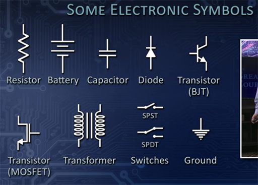 

### Simple Circuit

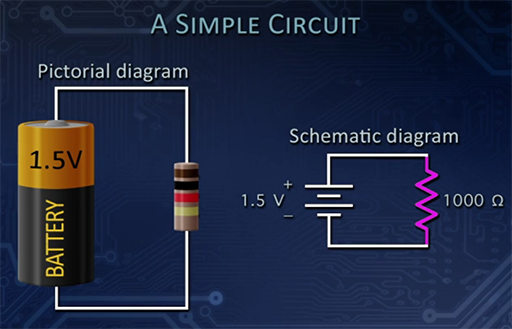 

## Voltage Sources

* **Battery**
* **Electric Generator**
* **Power Supply**
* **Wall outlets**

### Battery

Produces **electricity** through **chemical reactions**.

An **ideal battery** has **no resistance** and produces exactly the **same voltage across its terminals** regardless of how much **current** it is supplying. In reality, an **ideal battery** doesn't exist.  A **battery does not maintain** the same **voltage** in a **circuit** regardless of the **current** the **components** are asking it to supply.  If such an **ideal battery** did exist it would supply **all our energy needs**.

**V-I Characteristics** -- **voltage-current** characteristics.

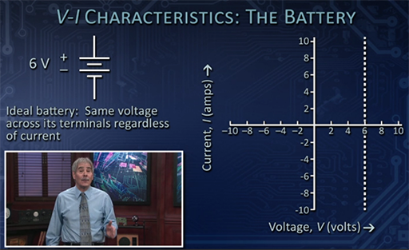 

It is a **vertical line** since the **voltage remains constant** regardless of the **current**.

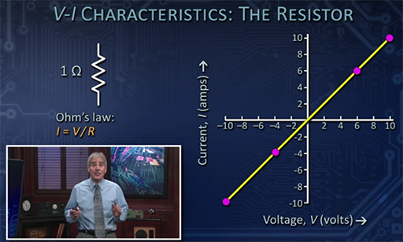 
 
 The **slope** of the **straight diagonal line** being **1 for the 1 ohm resistor**.  With a **2 ohm resistor** the **slope** would be **1/2** since the **voltage** is the **x-axis** and **current** is the **y-axis**.  This reflects the fact that there is **less current** with **more resistance**.

#### Real Batteries

When **modeling real batteries** you depict them as having an **internal resistor** connected **in series**.  **Real batteries** don't actually have **internal resistors** inside, but instead it represents the **internal resistance** based on the **material** from which the **battery is made**, and the **speed** of the **chemical reactions** in the **battery**.

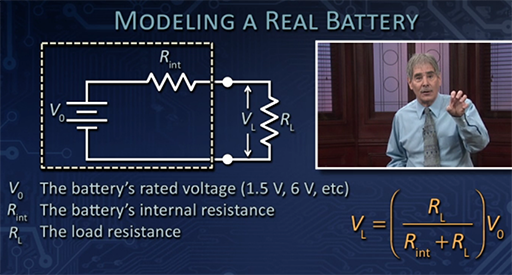 

The **real battery** when connected to a **circuit with resistance** forms a **voltage divider** (see the following section), with the **voltage** across the circuit's **resistor** being proportional to its own resistance compared to the **internal resistance**.

**Bigger batteries** have **lower internal resistance** and can therefore supply **more current**.  A **12V car battery** is able to supply a lot **more current** than two **6 volt lantern batteries in series** due to its size, along with other internal properties. 

## Connecting Components

### Series Connections

**Two components** are **in series** if the **current** flowing through one of them has **nowhere else to go** but through the **second component**.  If there is a possibility the **current** will flow in any **other direction** they are **not in series**.  In a **series** connection the **same current** flows through **both components**.

When their are **two resistors** in **series** the **resistance is the sum** of the two resistors.

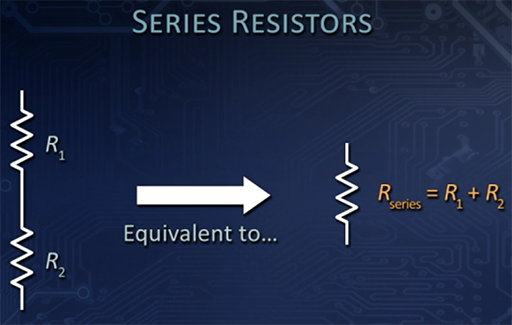 

#### Voltage Divider

A **voltage divider** circuit consists of **two resistors** in **series**.  It **divides the voltages in proportion to the resistances**.  The **current** remains **constant** across the **resistors** but the **voltage** is **proportional** to the **value of the resistor**.  If both **resistors** are the **same value** the **voltage** will be **divided in half**.  A **6V battery** on a circuit will show **3V** when measured **across each resistor**.

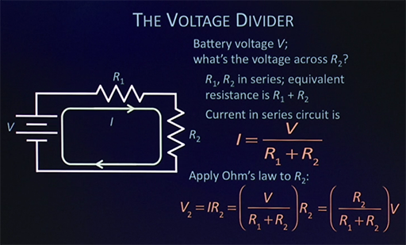 

You have to be careful that your **circuits** provide enough **load** for the **battery** since **too little resistance** places all the **voltage** across the **internal resistances** of the **battery**, which is why connecting the **two terminals** without any **resistance** will cause the **battery** to become **very hot** and it will eventually **fail**.

### Parallel Connections

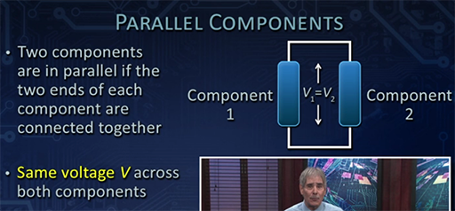 

**Parallel resistors** are like adding an extra lane on a highway, the **resistance** to the **flow** goes **down**.  With **resistors** the **resistance** value goes **down**.

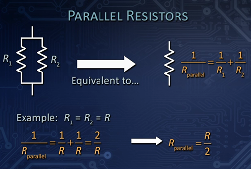 

While a **series connection** is often called a **voltage divider**, a **parallel connection** can be considered a **current divider**.

**Current** is **divided** in **proportion** to the **resistance**.

It is important to note that **not all connections** exhibit **series** or **parallels** characteristics.

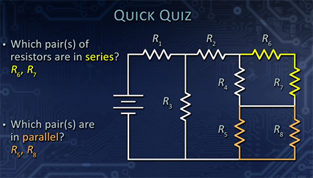 

### Summary

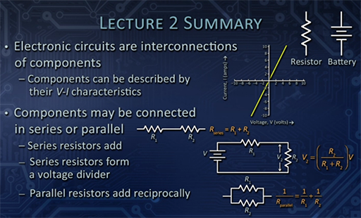 

