# Overview

Notes on the **Modern Electronics** course on **Great Courses** by **Richard Wolfsom**.

# References

tbd

## YouTube Refences

tbd

## My Other Notes

### Notes in this repository

* [ElectronicNotes](https://github.com/GitLeeRepo/ElectronicsNotes/blob/master/ElectronicsNotes.md#overview)

### Notes in Other Repositories

* [NotesGuidelines](https://github.com/GitLeeRepo/NotesGuidlines/blob/master/NotesGuidelines.md#overview)

# Table of Contents

tbd

# Concepts and Terminology

* **BJT Transistor** -- **Bipolar Junction Transistor**.  Commonly used in **audio amplifiers**.
* **Diode** -- a **one way valve** for **current to flow in one direction**.
* **Ground** -- the **common point** to which **many components are connected** and the **point** where **voltage differences** are compared.  On a **battery circuit** it is typically the **negative terminal** of the **battery**.  In **AC circuits** it is typically connected to the **physical earth ground**.
* **MOSFET Transistor** -- used in **digital logic circuits**
* **SPDT Switch** -- **Single Pole Double Throw switch**.
* **SPST Switch** -- **Single Pole Single Throw switch**.
* **Switches** -- devices for **opening** and **closing circuits**
* **Transformer** -- used for **changing voltage levels** in a circuit.  Used in **power supplies**.

# Lecture 01 -- Electricity and Electronics

**Electronics**  is defined as the branch of **Physics**, **Engineering**, and **Technology** dealing with **electrical circuits** that involve **active electrical components** such as **vacuum tubes**, **transistors**, **diodes**, and **integrated circuits**, and the associated **passive interconnection technologies**.

**Electronics** involves **controlling one electrical circuit by another**.

An **electrical circuit** is an **interconnection** of **components** intended to do something useful.

The **transistor** was one of the **most important inventions of the 20th century**.  It replaced the bulky, power hungry, and unreliable **vacuum tube**.  It was **solid state**, meaning it was built ou of **solid materials**, as opposed to **glass vacuums**.

The **integrated circuit** was the **next evolution**, which allowed **many transistors** to be placed on a single **silicon chip**.

**Moore's Law** -- the **number of transistors** on a chip will **double** every **18 months** (Gordon Moore 1965).

In **todays chips** there are **billions of transistors*, whereas one of the first large scale computers had a **few thousand tubes** that occupied an **entire room**.

## Electrical Charge

**Electrical charge** has **two states**, **positive** and **negatives** which are **opposite in charge**.  **Like charges repel each other** and **opposites attract**.

**Protons** are the main carrier of **positive charge**, with **hole** being the carriers of **positive charge** when you get into **semiconductors**.

**Electrons** carry the **negative charge**, with **metals** being **good conductors** of **free electrons**.  **Electrons** in **metals** are **not bound** to any **one atom**, but are **free* to **move around the entire metal material**.

An **electrical conductor** is a **material (primarily metals)** containing **free charges**

An **electrical insulator** is a **material lacking free charges** with those **charges bound to individual atoms and molecules**.

## Current

**Current** is a **flow of charge**.  It is the **amount of charge** that passes a **given point** in a **specific amount of time**.

The **unit of electrical current** is the **ampere (amp, A)**.  **1A** is equal to **6\*10^18 electrons per second**

**1A** is about the **current** need to power a **100W incandescent light bulb**.

In **electronics** you are typically dealing in **milliamp units (mA)**.

**Direction in a current** is that of the **positive charge**, even though most **current** is carried by **electrons**.  This is due to the **historical** assignment of the names by **Ben Franklin** who didn't know at the time about **electrons** and their **negative charge**.

## Voltage

**Voltage** is the **push** that moves the **current** through the wire or device.  It is the **measure** of the **energy per charge**.  Its **unit** is the **volt (V)**.

Examples:

* **AAA**, **AA**, **C**, and **D** **batteries** are **1.5V**
* **Car batteries** are **12V**
* **Wall outlets** are **120V**
* **Electronic circuits** are typically between **3.3V** and **15V**, with **5V** being **very common**.  **3.3V** is starting to show up in **newer devices**.

## Electric Power

* **Electric current** is the **amount** of **charge** per given **time**.
* **Voltage** is the **energy per charge**
* **Power** is the **voltage** \* **current**, or more specifically **(charge/time) * (energy/charge)** which is **equal to energy/time**

Therefore **Power** is **energy per time**.  It is the **rate** at which a system **delivers energy**, **consumes energy**, **loses energy**, **produces energy**

**Power** has the **unit watts (W)**

A **car battery**, while **cranking the starter**, is putting out **1500W (1.5kW)** which is **equal** to the **12V \* 125A**.  This is also about the same **rate in watts** that you **stove burner** consumes.

A **cell phone** typically has a **3.7V** battery and it **consumes** about **0.5W** while your **talking** and about **25mW** on **standby**.  This equates to **.15A (150mA)** while talking **0.5W/3.7V** and **6.8mA** while in standby **25mW/3.7V**.

## Resistance

**Resistance** measure the **resistance** to the **flow or electrical current**, measure in **ohms**.

**Conductors**, with the **exception of superconductors**, have **resistance** that **resists** the **flow of current**.

**Resistance** is a function of its **material**, **size**, and **shape**.

### Ohm's Law

**current = voltage/resistance**, which is written as **I = V/R**

Algebraic variations:

* **I = V/R**
* **V = IR**
* **R = V/**

The **ohm (Ω)** is the **unit of resistance**.  Note the **Alt-code** for this **Omega** symbol is **234**, which must be entered with the **Numlock on** and entered on the **keypad**.

**1Ω = 1V/1A**

With a **120V 20A circuit** you can have a **minimum resistance** of **6 ohms** which is **120V/20A**.  If you only apply **5 ohms** you will **blow the circuit breaker**.  The **maximum power** you can plug into this circuit is **2400W (20A \* 120V)** or **2.4kW**.

The **voltage** across a **1.8kΩ** with a **current** of **5mA** would be **9V  (5mA \* 1.8kΩ0)**

# Lecture 02 - Circuits and Symbols

An **electronic circuit** is an assemblage of interconnected electronic components.

## Electronic Symbols

 

### Simple Circuit

 

## Voltage Sources

* **Battery**
* **Electric Generator**
* **Power Supply**
* **Wall outlets**

### Battery

Produces **electricity** through **chemical reactions**.

An **ideal battery** has **no resistance** and produces exactly the **same voltage across its terminals** regardless of how much **current** it is supplying. In reality, an **ideal battery** doesn't exist.  A **battery does not maintain** the same **voltage** in a **circuit** regardless of the **current** the **components** are asking it to supply.  If such an **ideal battery** did exist it would supply **all our energy needs**.

**V-I Characteristics** -- **voltage-current** characteristics.

 

It is a **vertical line** since the **voltage remains constant** regardless of the **current**.

 
 
 The **slope** of the **straight diagonal line** being **1 for the 1 ohm resistor**.  With a **2 ohm resistor** the **slope** would be **1/2** since the **voltage** is the **x-axis** and **current** is the **y-axis**.  This reflects the fact that there is **less current** with **more resistance**.

#### Real Batteries

When **modeling real batteries** you depict them as having an **internal resistor** connected **in series**.  **Real batteries** don't actually have **internal resistors** inside, but instead it represents the **internal resistance** based on the **material** from which the **battery is made**, and the **speed** of the **chemical reactions** in the **battery**.

 

The **real battery** when connected to a **circuit with resistance** forms a **voltage divider** (see the following section), with the **voltage** across the circuit's **resistor** being proportional to its own resistance compared to the **internal resistance**.

**Bigger batteries** have **lower internal resistance** and can therefore supply **more current**.  A **12V car battery** is able to supply a lot **more current** than two **6 volt lantern batteries in series** due to its size, along with other internal properties. 

## Connecting Components

### Series Connections

**Two components** are **in series** if the **current** flowing through one of them has **nowhere else to go** but through the **second component**.  If there is a possibility the **current** will flow in any **other direction** they are **not in series**.  In a **series** connection the **same current** flows through **both components**.

When their are **two resistors** in **series** the **resistance is the sum** of the two resistors.

 

#### Voltage Divider

A **voltage divider** circuit consists of **two resistors** in **series**.  It **divides the voltages in proportion to the resistances**.  The **current** remains **constant** across the **resistors** but the **voltage** is **proportional** to the **value of the resistor**.  If both **resistors** are the **same value** the **voltage** will be **divided in half**.  A **6V battery** on a circuit will show **3V** when measured **across each resistor**.

 

You have to be careful that your **circuits** provide enough **load** for the **battery** since **too little resistance** places all the **voltage** across the **internal resistances** of the **battery**, which is why connecting the **two terminals** without any **resistance** will cause the **battery** to become **very hot** and it will eventually **fail**.

### Parallel Connections

 

**Parallel resistors** are like adding an extra lane on a highway, the **resistance** to the **flow** goes **down**.  With **resistors** the **resistance** value goes **down**.

 

While a **series connection** is often called a **voltage divider**, a **parallel connection** can be considered a **current divider**.

**Current** is **divided** in **proportion** to the **resistance**.

It is important to note that **not all connections** exhibit **series** or **parallels** characteristics.

 

## Summary

 

# Lecture 03 -- Instruments and Measurements

With **electrical measuring instruments** it is important to **minimize its impact on the circuit**

When **measuring** keep in mind that:

* **Voltage** is a **difference** of **energy** between **two points**.  When **connecting** a **voltmeter** you are connecting it in **parallel** to the **component** you are **measuring voltage across**.
* **Current** is a **flow** of **energy** through a **conductor**. When **connecting** an **ammeter** you are connecting it in **series** in the **circuit** you are **measuring current through**.

## Measuring Voltage with a Voltmeter

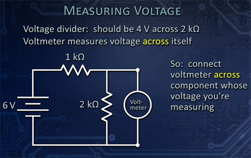

The **2 kΩ resister** gets **2/3** of the **voltage**, while the **1 kΩ resister** gets **1/3** of the **voltage**

The **voltmeter** has to go **across** or in **parallel** with what you are trying to **measure**.

If a **voltmeter draws current** it will**lower the voltage** and thus **impact the circuit**.  An **ideal voltmeter** would have **infinite resistance**.  A **good voltmeter** will have **a lot more resistance** than the **circuit itself** so that a **minimal current** flows through the **meter**.  **Digital voltmeters** typically have between **1 mΩ to 10mΩ** of **resistance**, which is **much better** than the **resistance** on an **analog meter**, which might only have **20kΩ** of **resistance**.

### Measuring voltage across resistors

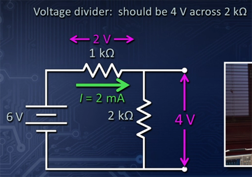

Note that while the **voltage varies** between the **two resistors**, the **current remains the same** throughout this **circuit**.

## Measuring Current through an Ammeter

An **ammeter measures current through itself**.  The **current** comes **in one lead**, goes through the **meter**, and then **out the other lead**.  You have to **break the circuit** and put the **ammeter in series** with the **component** you are **measuring.

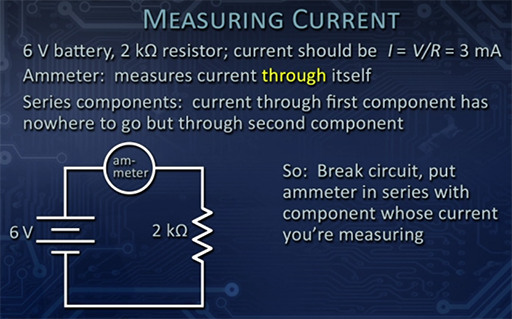

The **ideal ammeter** should have **zero resistance** to **not impact** the **measurement**.  In practices, it should be **much less** than the **rest of the circuit**.

**Important:** because an **ammeter** has **very little resistance**, you should **never** try to **measure across the terminals of a battery**, and you should **never** measure a **circuit** with **minimal resistance**, otherwise you **risk damaging** the **meter**, or at a minimum **blowing the fuse**.  Bottom line is **don't ever** put an **ammeter** across a **voltage source**.

## Measuring Resistance

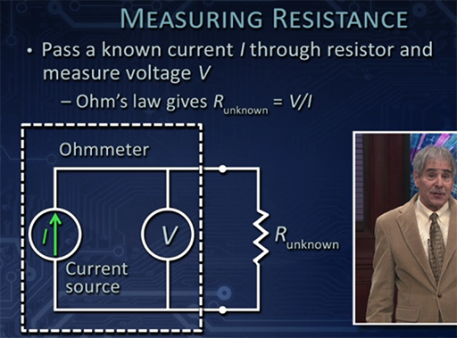

When **measuring resistance** the **ohmmeter** provides a **known current** and then it **measures the voltage**, and then through **Ohm's Law** it calculates the **resistance**.

Because the **ohmmeter** generates its **own current** you **do not** want to **measure resistance** while the **resistor** is **in the circuit**, since it would run the **current** through the rest of the **circuit**.

## The Oscilloscope

The **oscilloscope** measures **voltage as a function of time**.  It displays **voltage vs time** on a **screen**.

The original **oscilloscopes** used a **cathode ray tube** to display the image.

Today's **oscilloscopes** can **measure time intervals** in **billionths of a second**.  They are actually **computers** that **simulate** the same patterns on the **screen** as the old **CRts**, using a **flat screen display**.

# Lecture 04 -- AC vs DC

With **DC** you have a **steady voltage and curent**, whereas with **AC** you get a **time varying voltage and current**.

## AC

### Advantages of AC

* **Rotating generators** naturally produce **AC**
* It is **easy** to **transform change voltages** in **AC**
* **AC voltages** can be **stepped up** to **100s of thousands of volts** for **long distance transmission**.
* **AC** is used in **audio signals** which also **vary in time**

### Sine Waves

The **varying AC current** produces a **sine wave**.  **Sine waves** themselves can be **combined** to produce more **complex wave forms**.

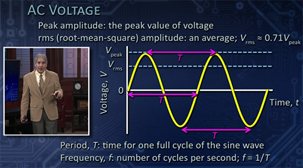

**Frequency** and **period** both represent **time**, but are **inverses of each other**.

**Amplitude** and **frequency (or period)** are the **two** things that **characterize AC signals**

When you talk about **120V, 60Hz AC power** this means **120V rms** (the **peak** is actually about **170V**)

## DC

### Advantages of DC

* **Electronic circuits** generally prefer **DC** voltage.

## Converting AC to DC

Because we use many **appliances** and **gadgets** that use **DC**, we need to be able **convert AC to DC**.  In addition, most **modern DC devices** use fairly **low voltages** and **currents**.  They often can be run on either **battery** or through **DC transformed** from **AC**.

### Components of a Power Supply used to Convert AC to DC

* **Transformer** -- steps the **voltage** **up** or **down**
* **Diode** -- only allows electricity to **flow** in **one direction**
* **capacitor** -- used here in a **power supply** to **smooth out** the **voltages**

In addition a **voltage regulator** is also **often used** in **power supply**. It's job is to keep the **voltage at a fixed level** according to its specification.

#### Transformer

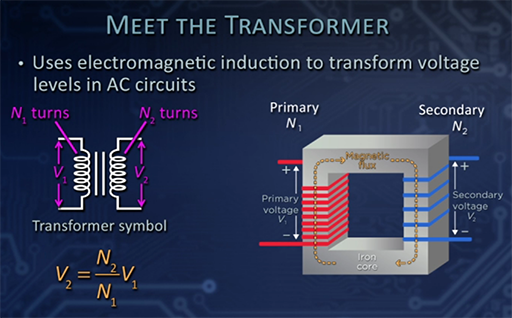

**Electromagnetic induction** is where a **changing current** in **one circuit** will **induce**  a **changing current** in **another circuit**.  The **intermediator** between the **two separate currents** is the **magnetic field**.

If you have the **same number of turns** on **both sides** you will get the **same voltage** on both sides.  **Isolated circuits** use **isolation transformers** like this, such as in **medical devices** and other **devices** that need this kind of **isolation**.

When you **step up voltage** with a **transformer** you get **stepped down current**.  The **high transmission power lines** have small relative  **currents**.

#### Diode

**Diodes** are a **one way** valve for electrical **current**.

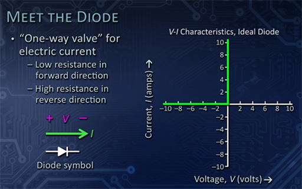

An **ideal diode** is like a **short circuit**, if you introduce power **huge amounts of current will flow**.

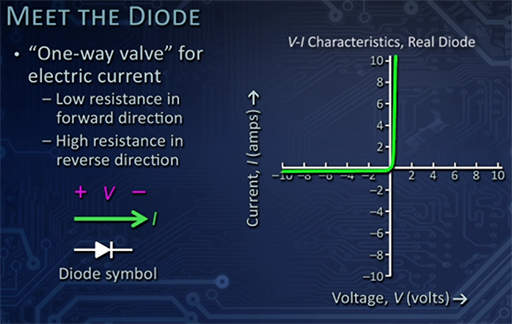

A **real diode** has a **slight curve** in its graph as the **curent increases**.

The **diode** looks kind of like a **resistor**, but only has **one bar** on the **end** to indicate which way **current flows**.

#### Capacitor

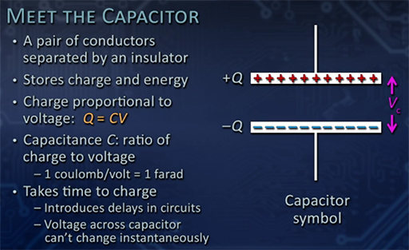

A **capacitor** is used in a **power supply** to **smooth out** the **voltages**. After the **diode** gets the current to flow in **one direction** the **diode flattens** this **half sign wave** into a fairly **straight line**.  There is a small bump at the **peak voltage** called **ripple**, for which you need to determine **how much ripple** your circuit can **tolerate** to determine how good of a power supply you need.

The **capacitor** needs to **hold** the **voltage** long enough for the **negative part of the cycle to complete**.  You need a **large enough capacitor** to hold this voltage.

#### Full Power Supply

All **three** of the above **components (transformer, diode, capacitor)** are present in the **power supply**.

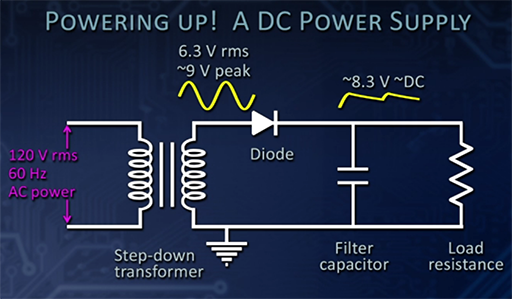

#### Voltage Regulator

A **voltage regulator** is an **integrated circuit** that looks similar to a **transistor** in that it has **3 leads**.  It actually consists of **multiple transistors internally**.  It's job is to keep the **voltage at a fixed level** according to its specification.

After going through a **voltage regulator** you should see very little **ripple** in the **output signal**.

This diagram shows an **improved power supply** with the **voltage regulator added**:

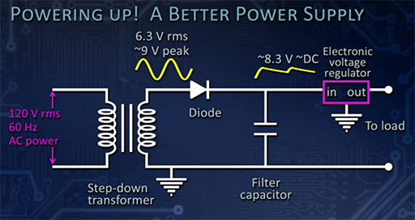

# Lecture 05 -- Filter Capacitors

* **Filter Circuits** -- used to process **different frequencies**.  You can use them to **filter out** certain **frequencies ranges** which can be useful for different things, including removing **noise**.

On **audio equipment** the **treble**, **bass**, and **Equalizer** settings are used to **filter frequencies**.

## Capacitors

**Capacitors** are the components that allows us to **filter signals**.

**Capacitors** **store charge**.

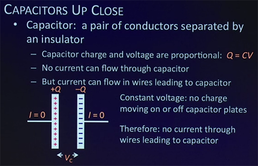

**Charge** has a different relations to **voltage** in a **capacitor** than it does in a **resistor**.  In a **resistor** **current** is directly proportional to the **voltage**.  In a **capacitor**, the **current leading to the capacitor** (**current doesn't flow through a capacitor**) is dependent on how **rapidly** the **current** is **changing**.

* In a **resistor** -- **current** is **directly proportional** to **voltage**
* With a **capacitor** -- **current** is **dependent** on how **rapidly** the **current changes**.

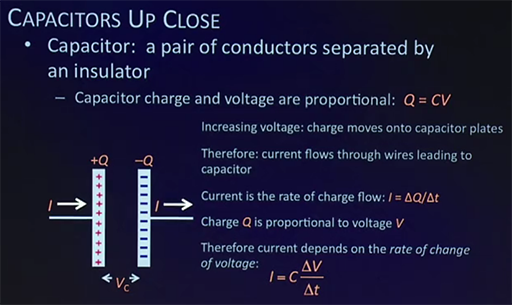

Note below how the **current** is **leading**** the **voltage** by a 90 degrees (quarter cycle).

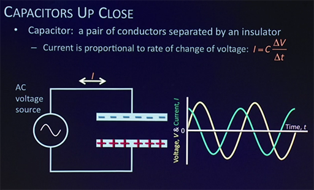

In **capacitors** **current leads voltage**.  It reaches its **peak** before **voltage**, since as it is **charging** from a **zero voltage** **current** is at its **maximum** and when **voltage** is at its **maximum** **current** is **no longer flowing** since it is fully charged.

Note here how the **higher frequencies** leads to **higher currents** and **shorter periods**.  With **high frequencies** there is a **lower resistance**, and vice versa.  

If the **frequency** is **very high** the **capacitor** acts like a **wire/short circuit**.  For example, to remove **noise** you place a **capacitor** to **filter high frequencies** with a **connection/short/shunt** to **ground** for those **frequencies**.

In contrast a **very low frequency capacitor** acts like an **open circuit** where **no current** can **flow**.

**Capacitive reactance** (X subscript c) is the **amount of resistance** a **capacitor** is providing.  It is **proportional** to **1/fC** with **fC** being the **frequency \* capacitance**.

The **key takeaway** from this section is that **current** responds to the **rate of change** in **voltage**.

## Filters

### Low Pass Filters

The following diagram compares a **voltage divider resistor** circuit, with a similar **capacitor** circuit.

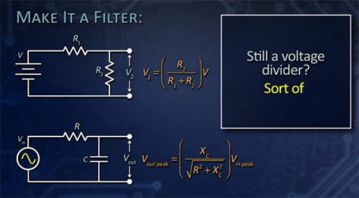

The **capacitor** version of the **voltage divider** circuit is **sort of** like the **resistor** version, but the **relationship is more complicated** and is **dependent on frequency**.

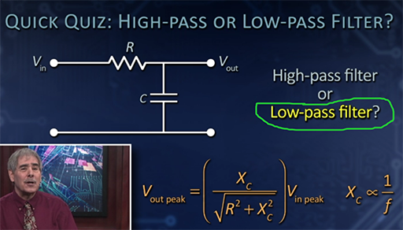

The above is a **low pass filter** because the **low frequencies** continue to the **output** while the **high frequencies** are **shorted to ground**.  Therefore at **high frequencies** it is acting like a **voltage divider**.

This particular type of **low pass circuit** is **good at removing noise**.

### High Pass Filters

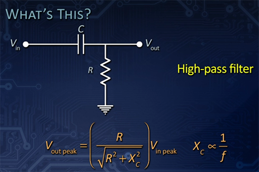

The above **high pass filter** the **capacitor** acts like a **big resistor** at **low frequencies** and an **open circuit (wire)** to **high frequencies** allowing them to pass through to the **output**.

### Comparing High and Low Pass Filters

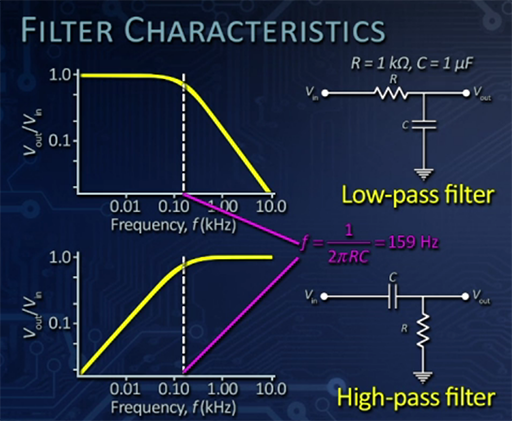

Note that the **frequency** is using a **logarithmic scale**

For the **low frequencies** in the above diagram, there is **very little variation** until just before it gets to **159Hz** when it starts to **fall off rapidly**.  By the time you get up to **10kHz** in the **output** you have almost **no voltage**.

### Band Filter

You get a **band filter** when you put a **low pass** and **high pass** filter **together**.

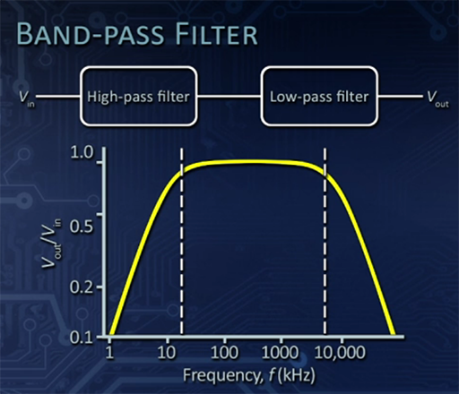

This allows you to only **pass signals** within a particular **bandwidth**.

**Bandwidth** determines **how much signal** you can carry on a **signal path**. Think of each **bit** as a **voltage peak** so at **higher frequencies** you get more **peaks/bits** in a given **time**, which in communications is **1 second** (the analogy is mine, not from the instructor)

### Filter Application -- Audio

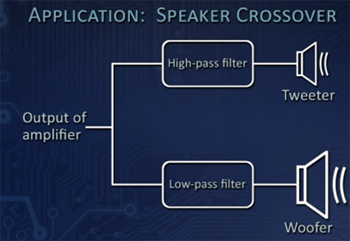

A **woofer** can't vibrate very fast at high frequencies, but because it is bigger it is well suited to **low frequencies**.

The smaller **tweeter** can vibrate much more rapidly, which makes it good for **high frequencies**.

The **high** and **low pass filters** divide the **signals** appropriately between the two types of **speakers**

### Notch Filters

**Notch filters** remove a **very narrow band of frequencies**

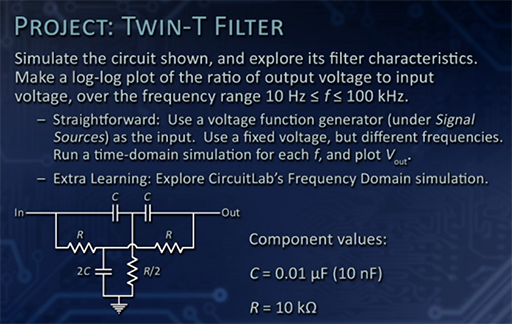

