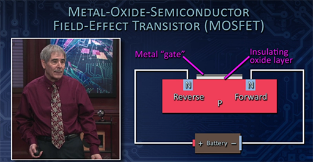
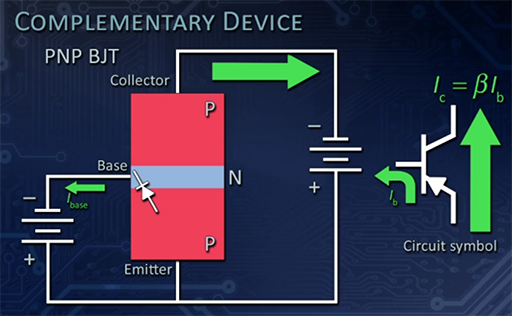

# Overview

**Chapter 7 through 12** notes on the **Modern Electronics** course on **Great Courses** by **Richard Wolfsom**.

# References

* [Course Guide PDF](pdf/ModernElectronicsGreatCourses.pdf)

## YouTube Refences

tbd

## My Other Notes

### Notes in this repository

* [ElectronicNotes](https://github.com/GitLeeRepo/ElectronicsNotes/blob/master/ElectronicsNotes.md#overview)
* [GreatCoursesNotesCh01-06](https://github.com/GitLeeRepo/ElectronicsNotes/blob/master/GreatCoursesNotesCh01-06.md#overview)
* [TransistorSupplementGC](https://github.com/GitLeeRepo/ElectronicsNotes/blob/master/TransistorSupplementGC.md#overview)

### Notes in Other Repositories

* [NotesGuidelines](https://github.com/GitLeeRepo/NotesGuidlines/blob/master/NotesGuidelines.md#overview)

# Table of Contents

tbd

# Concepts and Terminology

Refer to [GreatCoursesNotesCh01-06](https://github.com/GitLeeRepo/ElectronicsNotes/blob/master/GreatCoursesNotesCh01-06.md#overview)

# Lecture 07 -- Transistors

The **transistor** is one of the **most important inventions** of the **20th century**.  They are at the **heart** of all **modern electronics**. It replaced the **vacuum tube**, and continued to get **smaller and smaller** over the years to the points that there are **billions** of them on some **microprocessors** today.

**Transistors** are used to allow **one electronic circuit to control another**.  For **one circuit** to **control another** you need **at least 3 connections**.

**Transistors** are used as:
* **Switches**
* **Amplifiers**

 

As shown in the diagram above, the **controlling circuit** and the **controlled circuit** must have **one connection in common** (shown as the bottom connection above).

* **FET -- Field Effect Transistors** are **voltage controlled**.  They are easier to understand.  They are used in **digital electronics** for **switching**. They will be covered in more detail later in the course.

* **BJT -- Bipolar Junction Transistors** are **current controlled**. They are **gradually being obsoleted by FETs**.  They are still **widely used** in **amplifiers and audio amplifiers**.

## FET -- Field Effect Transistors

**FETs** are **voltage controlled devices**.

There are **two types** of **FETs**

* **MOSFET -- Metal-oxide-semiconductor Field Effect Transistor** -- **widely used** in **semiconductor electronics**.  Your cell phone, digital TV, and computer are full of them.

* **JFET -- Junction Field Effect Transistors**

### MOSFET

* **MOSFETs** are **voltage controlled transistors**, as opposed to the **BPJ Transistors** which are **current controlled**
* Because they are **voltage controlled** they **draw very little current**, which is beneficial to **battery controlled** circuits, providing longer battery life.
* They are not as effective at **high speed/frequency switching** as **BJT transistors**, which make **BJTs** better for **radio and audio circuits**. NOTE: verify this, since this seems backward, since they are preferred in **high speed digital circuits**.
* Connections include:
  * **Source** -- similar to the **collector**
  * **Drain** -- similar to the **emitter**
  * **Gate** -- **voltage controlled** switch that turns it on or off.  Similar to the **base** on **BPJ Transistors**
  * **Body** -- normally connected to the

 

In the above example:

* It is a block of **P-type semiconductor** with **two smaller** blocks of **N-type** material
* This contains **two PN junctions** as opposed to the **one junction in the diodes**
* As pictured, **no current** can flow through the device because of the **reverse bias**.  Even if you turn the battery around, the **reverse bias** will flip to the other side.
* In order for **current to flow** you need a **3rd connection at the gate**.
* You can see where the name comes from The **metal of the gate**, the **oxide of the insulating layer**, and the **semiconductor** of the **NPN** portion of the transistor.
* There is a very **high resistance** between the **metal gate**, where you feed in a **weak signal** and the **semiconductor** due to the **insulating layer**.  Therefore, they **draw very little current from the circuit to which they are connected**.
* By applying a **positive voltage** to the **insulated gate** from which it will get a **positive charge**
* The **positively charged gate** will attract the **negatively charged electrons** to the **other side of the **insulated gate**.
* The **negatively charged electrons** form between the two **N blocks** in what's called the **channel**, enabling **current to flow**.
* The **transistor** has been **turned on** and it can now **conduct current**.

 

The above is an **N-channel MOSFET** because the current flows through the **N-terminals** and the **channel between them**.  There are also **P-channel MOSFETs**.

* You can **control the amount of charge on the gate**, which will **effect how much current can flow through the N-channel**.
* It can be thought of as a **voltage controlled resistor**.
* The **current** is controlled by **how much current is applied to the gate**.

 

The **symbol** below is one **common version** of the **MOSFET symbol**, but different sources use different symbols.

 

The **arrow** in the **symbol** above, being on the **right and pointing down**, indicates it is an **N-channel MOSFET**.

For the **P-channel MOSFET symbol** the **arrow on the right points up**:

 

### JFET -- Junction Field Effect Transistor

 

Below is an example of a **cylindrical JFET**:

 

Below you can see that **current flows in the N-Channel** when **no voltage** is applied to the **P-terminal**:

 

But when a **charge is applied to the P-terminal** the **current is stopped (turned off)** in the **N-channel** or the **amount of resistance to current is varied** through **varying amounts of voltage**.

 

## BPJ -- Bipolar Junction Transistor

* **BJT -- Bipolar Junction Transistors** are **current controlled**. They are **gradually being obsoleted by FETs**.  They are still **widely used** in **amplifiers and audio amplifiers**.

 

Notice in the above the the **P-type** region is **very narrow** so the **current can flow across it**.  With just this connection **current will flow** from the **battery to the base through the emitter and back to the battery**.

 

* The above adds a **controlled circuit** on the right, with the **controlling circuit** on the left.  Assume a **bigger battery** on the right.  **Current will cross the base into the collector**
* The **collector to base** connection is **reverse biased** with the **battery point the reversed way**.
* The **emitter**gets its name from the fact that it **emits free electrons**, some of which will be **drawn into the collector to make a current**.
* The **collector current** is much **bigger than the base current**, with **100 times the current being typical**.
* The **collector current** is **bigger by a factor of Beta** in the equation, with **Beta** typically being on the order of **100 or so**.  
* **Beta** is the **current gain**.
* On the **symbol the arrow shows the base current flowing out the emitter**.

 

* The **BJT** type of **transistor multiplies currents**.
* The **current** on the **base** controls **how much current can flow through the collector** through the **equation** picture above.
* The above assumes a **base current of 0.6mA** and a **Beta of 100**, therefore the **collector current is 100 times the base current**.

 

The above shows a **PNP BJT**, which is the **complement** of the **NPN BJT** that we looked at in detail above. Everything is **reversed (batteries, current)** from the **NPN BJT**.

### Application -- BJT Transistor as a Switch

This circuit **lights a light bulb** when **enough current goes to the base** in order to **turn on the transistor**.

 

## Transistor Supplementary Material

Refer to my [TransistorSupplementGC](https://github.com/GitLeeRepo/ElectronicsNotes/blob/master/TransistorSupplementGC.md#overview) notes for additional **transistor information** from other sources.

## Project

 
