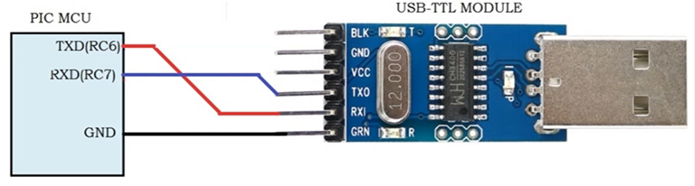

# Overview

Notes on the **PIC architecture and assembly language**.

# References

## PDF Manuals

* [PIC Instruction Set](pdf/Datasheets/PIC/PIC-instruction-set-31029a.pdf)

## YouTube Refences

tbd

## My Other Notes

### Notes in this repository

* [ElectronicNotes](https://github.com/GitLeeRepo/ElectronicsNotes/blob/master/ElectronicsNotes.md#overview)
* [PICNotes](https://github.com/GitLeeRepo/ElectronicsNotes/blob/master/PICNotes.md#overview)
* [USB2Notes](https://github.com/GitLeeRepo/ElectronicsNotes/blob/master/USB2Notes.md#overview)

### Notes in Other Repositories

* [NotesGuidelines](https://github.com/GitLeeRepo/NotesGuidlines/blob/master/NotesGuidelines.md#overview)

# Contents

tbd

# Concepts and Terminology

* **ANSELx** -- **analog select registers**

* **BOR** -- the **Brown Out Reset circuit** holds the device in **reset** when **VDD** reaches a **selectable minimum**.

* **BOREN** -- **Brown Out Reset Enable bits**

* **Data Memory** -- the **volatile RAM**.  It contains the **GPR (General Purpose Registers)** and **Special Registers**, along with **memory variable values** that are **not persisted** across **restarts**

* **EEPROM** -- **Electrically Erasable Program Read-Only Memory** -- used to **save memory values** when the **microcontroller is turned off** so that it is **availble when turned on** again.  See also **Program Memory** and **Data Memory**

* **GPR (General Purpose Registers)**

* **LATx** -- **latch registers** -- use this to **write to ports**.  Use **PORTx** to **read from ports**.

* **LVP** -- **Low Voltage Programming**

* **MCLR** -- an **external input** that can **reset the device**.  If it is **disabled**, its **pin** will function as a **general purpose input**

* **PLL** -- **Phase Locked Loop** -- works together with **oscillators** to generate a variety of **clock sources**.  For example, on the **PIC16F1619** it can be used with the **oscillators** to generate one of three **internal clocks**, the **HFINTOSC** at **16MHz**, the **MFINTOSC** at **500kHz**, and the **LFINTOSC** at **31kHZ**,

* **POR**  -- **Power On Reset**

* **PORTx** -- **port registers** -- use this to **read from ports**.  Use **LATx** to **write to ports**.

* **Program Memory** -- the **memory** that contains the **executable machine code** we program.  The **program counter** steps through this memory. 

* **Special Registers** -- includes **Core Registers**, such as **Status** and **WReg**, along with **PORT/IO registers**, **Timer Registers**, among others.

* **TRISx** -- setting the corresponding it to **1 enables input** on that **port**, setting it to **0 enables output** on the port.  For example, setting **TRISA2 = 0** sets **port A2 to output**.

* **WDT (Watchdog Timer)** -- automatically **resets the processor** after a given **user-defined period**.  This allows programs to **escape from endless loops** 

# PIC 8-Bit Memory Organization

## Data Memory

* **Data Memory** -- the **volatile RAM**.  It contains the **GPR (General Purpose Registers)** and **Special Registers**, along with **memory variable values** that are **not persisted** across **restarts**

### Memory Banks

From: [microcontrollerboard.com](http://www.microcontrollerboard.com/pic_memory_organization.html)
The **data memory** is partitioned into **multiple banks** which contain the **General Purpose Registers** and the **Special Function Registers**. Number of banks may vary depending on the microcontroller; for example, micro PIC16F84 has only two banks.

Each bank extends up to **7Fh (128 bytes)**. The **lower locations** of each bank are reserved for the **Special Function Registers**. Above the Special Function Registers are **General Purpose Registers**, implemented as static RAM. While program is being executed, it is working with the particular bank. The **default bank is BANK0**.

To access a register that is located in another bank, one should access it inside the program. There are **special registers which can be accessed from any bank**, such as **STATUS register**.

Following from: [PIC16F1619 Datasheet](pdf/Datasheets/PIC/PIC16F1619DataSheet.pdf)

Following from: [PIC16F1619 Datasheet](pdf/Datasheets/PIC/PIC16F1619DataSheet.pdf)

Following from: [PIC16F1619 Datasheet](pdf/Datasheets/PIC/PIC16F1619DataSheet.pdf)

### Special Registers

* **Special Registers** -- includes **Core Registers**, such as **Status** and **WReg**, along with **PORT/IO registers**, **Timer Registers**, among others.

#### Core Registers

The **core registers** are **special registers** used for **basic operations** which occupy the **first 12 addresses of every bank**.

* **BSRx** -- **Bank Select Registers** -- used to **select the memory bank**
* **INDFx** -- **Indirect File registers** -- not actual physical registers, but references to **FSRx** registers.
* **FSRx** -- **File Select Registers** -- used to **select location in memory bank**
* **PCL** -- **program counter**
* **STATUS**
* **WREG** -- **Working Register**

#### Analog to Digital/Digital to Analog

* **ADCONx** -- **Analog to Digital Control**

#### Internal Oscillator Registers

* **BORCON**
* **OSCCON**
* **OSCTUN**
* **WWDT**

#### IO/Port/Pin Registers

* **ANSELx** -- **analog select bits**.  For those **ports** that support **analog** it **defaults to analog**, set to **zero to use as digital**.
* **INLVLx**  register controls the **input voltage threshold** for each of the **input pins**.
* **LATx** -- **latch registers** -- use this to **write to ports**.  Use **PORTx** to **read from ports**.
* **ODCONx** -- controls the **Open Drain** feature of the **port**. When an **ODCONx bit is set**, the corresponding port output becomes an **open-drain driver** capable of **sinking current only**. When an **ODCONx bit is cleared**, the corresponding **port output pin** is the standard push-pull drive capable of **sourcing and sinking current**.
* **PORTx** -- **port registers** -- use this to **read from ports**.  Use **LATx** to **write to ports**.
* **SLRCONx** register controls the **slew rate** option (the **rate** at which a **signal changes**) for **each port pin**. When an **SLRCONx bit is set**, the corresponding **port pin** drive is **slew rate limited**. When an **SLRCONx bit is cleared**, the corresponding **port pin** drive **slews at the maximum** rate possible.
* **TRISx** -- setting the corresponding it to **1 enables input** on that **port**, setting it to **0 enables output** on the port.  For example, setting **TRISA2 = 0** sets **port A2 to output**.
* **WPUx** -- **weak pull-up** controls the individual **weak pull-ups** for **each port**.  **Weak pull-ups** are useful for **switches**, but are not desirable for **loads** in that they support **very little current**.

#### Timer/Clock/Interrupt Related Registers

* **INTCON** -- **Interrupt Control register** -- an **interrupt** is **enabled** by setting the **INTE bit** of the **INTCON register**
* **TMRx**
* **PIEx** -- **Peripheral Interrupt Enabled registers**
* **PIRx** -- **Peripheral Interrupt Request registers**
* **PR2**
* **T2CLKCON**

#### UART Registers

* **RC1REG** -- **Receive Data Register**
* **TX1REG** -- **Transmit Data Register**
* **SP1BRGx** -- **Baud Rate Generator** -- x = Low or High

### Device Configuration

There are several **Configuration Word bits** that allow **direct oscillator and memory protection options**.  These are **stored in flash memory** and are therefore available after **restart**.  

* **CONFIG1**
* **CONFIG2**
* **CONFIG3**

These **configuration word bits** in **flash memory** are sometimes referred to as **fuses**, because they used to be **burned directly on the chip**.

They are accessible in the **MPLAB IDE** by either selecting the menu **Window >> PIC Memory Views >> Configuration Bits** or in the **MPLAB Code Configurator** on the **System Module panel**. The **Window >> PIC Memory Views >> Configuration Bits** option displays the **configuration options** in the lower panel.  After you make changes you need to **Generate Source Code to Output**, which will place **assembler directives** in the **output** that you can then **paste into your assembly code**.  With the **MPLAB Configurator** option, your changes also must be **generated**, but in this case it **generates the C source and header files** adding them to your project.

## Program Memory

* **Program Memory** -- the **memory** that contains the **executable machine code** we program.  The **program counter** steps through this memory. 

## EEPROM Memory

* **EEPROM** -- **Electrically Erasable Program Read-Only Memory** -- used to **save memory values** when the **microcontroller is turned off** so that it is **availble when turned on** again.  See also **Program Memory** and **Data Memory**

# Clock, Oscillators and Timers

There are **two types** of **clock sources**

* **External** -- relies on **external circuitry** for **clock source**.  Examples include **ECH (high power 4 to 20MHz)**, **ECM (medium power 0.5 to 4MHz**, and **ECL modes (low power 0 to 8.5MHz)** and **quartz crystal resonators** or **ceramic resonators** **(HS Mode)**.

* **Internal** -- contained within the **internal oscillator module**.  On the **PIC1619** the **internal oscillator block** contains **two internal oscillators** and a dedicated **phase lock loop (HFPLL)**.

## OSCCON Register and its System Clock Select (SCS) Bits

The **external** or **internal clock** is selected with the **System Clock Select (SCS) bits** in the **OSCCON register**.

Note that on the **MCC code configurator** in **MPLAB X**, under the **System Module Internal Oscillator** you can choose between **FOSC** and **INTOSC**.  By selecting **FOSC** it tells the compiler to use the **FOSC bits** in the **Configuration Words** to **select the clock**, with both **external and internal modes**.

## FOSC Bits

**Clock source modes** are selected with the **FOSC bits** in the **Configuration Words**. The **FOSC bits**
determine the **type of oscillator** that will be used when the device is first powered.

**Modes** selectable in the **FOSC bits**

* **ECH** -- external high power **4 to 20MHz**
* **ECM** -- external medium power **0.5 to 4MHz**
* **ECL** -- external low power **0 to 0.5MHz**
* **HS** -- external high gain crystal or ceramic resonator mode (**4 MHz to 10 MHz**)
* **INTOSC** -- internal oscillators **HFINTOSC** at **16MHz**, the **MFINTOSC** at **500kHz**, and the **LFINTOSC** at **31kHZ**

## PLL -- Phase Lock Loop

* **PLL** -- **Phase Locked Loop** -- works together with **oscillators** to generate a variety of **clock sources**.  **PLLs** are used to **generate a multiple of the input frequency**.  A **4x PLL** will generate an **output frequency 4x the input frequency**.  In the **MCC code configurator**, on the **System Module** you can see which **frequencies support PLL**.  On the **PIC16F1619**, which has a **4x PLL**, you can use either **8MHz** or **16MHz** for a **maximum of 32MHz** (so I assume with 16MHz it operates as a 2x PLL, whereas with 8MHz it is a 4x PLL)

For example, on the **PIC16F1619** it can be used with the **oscillators** to generate one of three **internal clocks**, the **HFINTOSC** at **16MHz**, the **MFINTOSC** at **500kHz**, and the **LFINTOSC** at **31kHZ**.

# Interrupts

**Interrupts** allow certain **events to preempt normal program flow**.  They can be used for such things as **waking up the device** from **sleep mode**, among others.

# UART/EUSART

Refer to:

* [USB2Notes](https://github.com/GitLeeRepo/ElectronicsNotes/blob/master/USB2Notes.md#overview)
* [Set up EUSART to display ADC value](https://www.youtube.com/watch?v=9kzu_eoKQKo) -- YouTube video
* [WINGONEER USB 2.0 to TTL UART 6PIN CP2102 Module Serial Converter](https://www.amazon.com/WINGONEER-CP2102-Module-Serial-Converter/dp/B01LRVQIFQ/ref=cm_cr_arp_d_product_top?ie=UTF8)
* [Drivers for USB to UART bridge](https://www.silabs.com/products/development-tools/software/usb-to-uart-bridge-vcp-drivers)

## Serial to USB

# I2C Protocol

* **Synchronous**
* Up to **3.4MHz Clock (High-Speed mode)**
* **Master-Slave type bus** with **Master providing the clock**
* **Serial bus** with two lines for **Serial Clock (SCL)** and **Serial Data (SDA)**
* **Pull-up resistors** are required, typically **3.3KΩ for 3.3V** and **4.7KΩ for 5V**

# Modules

## Analog-to-Digital Converter (ADC) Module

tbd

## Angular Timer (AT) Module

tbd

## Capture/Compare/PWM (CCP) Modules

tbd

## CCP Module

tbd

## Configurable Logic Cell (CLC) Module

Use **configurable gates (AND, OR, XOR, etc)** to **reduce 16 input lines** to **4 logic lines**, along with **combinational logic (AND-OR, OR-XOR, Latches and Flip-Flops).  

## Comparator Module

tbd

## Complimentary Waveform Generator (CWG) Module

tbd

## Cyclical Redundancy Check (CRC) Module

## Digital-to-Analog Converter (DAC) Module

tbd

## Enhanced Universal Synchronous Asynchronous Receiver Transmitter (EUSART)

tbd

## Fixed Voltage Reference (FVR) Module

tbd

## Interrupt-On-Change-Module

tbd

## I2C Interface Module

Refer to **I2C Protocol** section

## Master Synchronous Serial Port (MSSP) Module

tbd

## Math Accelerator Proportional-Integral-Derivative (PID) Module

tbd

## Oscillator Module

tbd

## Peripheral Pin Select (PPS) Module

tbd

## Pulse Width Modulation (PWM) Module 

tbd

## Signal Measurement Timer (SMT) Module

tbd

## SPI Module

tbd

## Temperature Indicator Module

tbd

## Timer Modules

tbd

## Watch Dog Timer (WDT) Module

tbd

## Zero-Cross-Detection (ZCD) Module

tbd

# Udemy Course Blinker Assembly Language Program Example 

## Project Setup

1. Create the project
2. Select **Microchip Embedded** and **Standalone Project**
3. Select your **microchip**, for example **PIC
4. Select if you want a Debug Header (select No)
5. Select the kind of **programmer** you are using, such as **Pickit 3**
6. Select the Assembler **MPASM**
7. Select and save the project

## Setting Up the Program

1. Select the **Projects Tab** and under the **project's name** **right-click** on the **Source Files** folder
2. Select **New** and select one of the two **asm templates** (doesn't matter we will overwrite)
3. Give the **asm file a name** and select **Finish**
4. **Right-click** on the **Project's Name** and select **Properties**
5. **Click** on **Pickit 3**, or whatever **programmer** your using
6. From the **drop down** on the **right hand panel** select **Program Options**
7. Check **Use Low Voltage Programming Mode**
8. Select again from the **Program Options** and choose **Power**
9. If necessary lower the **voltage** from **5V** to a **lower value**, such as **4.5V**.  This is necessary if you get errors during programming the device due to **insufficient voltage put out by the USB**.  This will vary between computers.
10. In the **left hand panel** select **mpasm (Global Options)**
11. **Check Build in Absolute Mode** and click **Ok**

## Add the Assembly Code

1. Open the **asm file** you created
2. Replace the existing template code with the **Blinker.asm** example code
