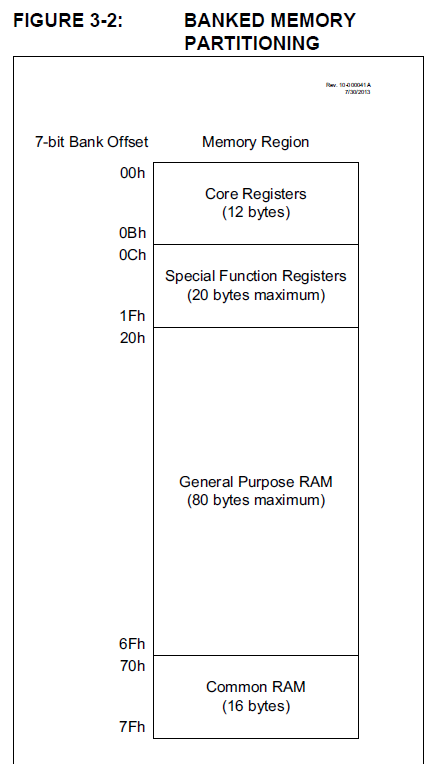
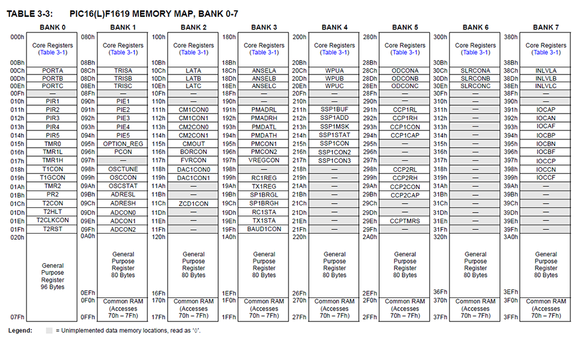
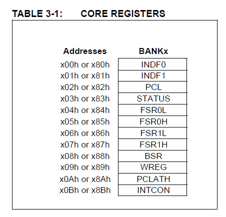

# Overview

Notes on the **PIC architecture and assembly language**.

# References

## PDF Manuals

* [PIC Instruction Set](pdf/Datasheets/PIC/PIC-instruction-set-31029a.pdf)

## YouTube Refences

tbd

## My Other Notes

### Notes in this repository

* [ElectronicNotes](https://github.com/GitLeeRepo/ElectronicsNotes/blob/master/ElectronicsNotes.md#overview)
* [PICNotes](https://github.com/GitLeeRepo/ElectronicsNotes/blob/master/PICNotes.md#overview)

### Notes in Other Repositories

* [NotesGuidelines](https://github.com/GitLeeRepo/NotesGuidlines/blob/master/NotesGuidelines.md#overview)

# Contents

tbd

# Concepts and Terminology

* **BOR** -- the **Brown Out Reset circuit** holds the device in **reset** when **VDD** reaches a **selectable minimum**.

* **BOREN** -- **Brown Out Reset Enable bits**

* **Data Memory** -- the **volatile RAM**.  It contains the **GPR (General Purpose Registers)** and **Special Registers**, along with **memory variable values** that are **not persisted** across **restarts**

* **EEPROM** -- **Electrically Erasable Program Read-Only Memory** -- used to **save memory values** when the **microcontroller is turned off** so that it is **availble when turned on** again.  See also **Program Memory** and **Data Memory**

* **GPR (General Purpose Registers)**

* **LVP** -- **Low Voltage Programming**

* **MCLR** -- an **external input** that can **reset the device**.  If it is **disabled**, its **pin** will function as a **general purpose input**

* **POR**  -- **Power On Reset**

* **Program Memory** -- the **memory** that contains the **executable machine code** we program.  The **program counter** steps through this memory. 

* **Special Registers** -- includes **Core Registers**, such as **Status** and **WReg**, along with **PORT/IO registers**, **Timer Registers**, among others.

* **WDT (Watchdog Timer)** -- automatically **resets the processor** after a given **user-defined period**.  This allows programs to **escape from endless loops** 

# PIC 8-Bit Memory Organization

## Data Memory

* **Data Memory** -- the **volatile RAM**.  It contains the **GPR (General Purpose Registers)** and **Special Registers**, along with **memory variable values** that are **not persisted** across **restarts**

### Memory Banks

From: [microcontrollerboard.com](http://www.microcontrollerboard.com/pic_memory_organization.html)
The **data memory** is partitioned into **multiple banks** which contain the **General Purpose Registers** and the **Special Function Registers**. Number of banks may vary depending on the microcontroller; for example, micro PIC16F84 has only two banks.

Each bank extends up to **7Fh (128 bytes)**. The **lower locations** of each bank are reserved for the **Special Function Registers**. Above the Special Function Registers are **General Purpose Registers**, implemented as static RAM. While program is being executed, it is working with the particular bank. The **default bank is BANK0**.

To access a register that is located in another bank, one should access it inside the program. There are **special registers which can be accessed from any bank**, such as **STATUS register**.

Following from: [PIC16F1619 Datasheet](pdf/Datasheets/PIC/PIC16F1619DataSheet.pdf)

Following from: [PIC16F1619 Datasheet](pdf/Datasheets/PIC/PIC16F1619DataSheet.pdf)

Following from: [PIC16F1619 Datasheet](pdf/Datasheets/PIC/PIC16F1619DataSheet.pdf)

### Special Registers

* **Special Registers** -- includes **Core Registers**, such as **Status** and **WReg**, along with **PORT/IO registers**, **Timer Registers**, among others.

#### Core Registers

The **core registers** are **special registers** used for **basic operations** which occupy the **first 12 addresses of every bank**.

* **BSRx** -- **Bank Select Registers** -- used to **select the memory bank**
* **INDFx** -- **Indirect File registers** -- not actual physical registers, but references to **FSRx** registers.
* **FSRx** -- **File Select Registers** -- used to **select location in memory bank**
* **PCL** -- **program counter**
* **STATUS**
* **WREG** -- **Working Register**

#### Internal Oscillator Registers

* **BORCON**
* **OSCCON**
* **OSCTUN**
* **WWDT**

#### IO/Port/Pin Registers

* **ANSELx**
* **LATx**
* **TRISx**
* **PORTx**

#### Timer/Clock/Interrupt Related Registers

* **INTCON** -- **Interrupt Control register** -- an **interrupt** is **enabled** by setting the **INTE bit** of the **INTCON register**
* **TMRx**
* **PIEx** -- **Peripheral Interrupt Enabled registers**
* **PIRx** -- **Peripheral Interrupt Request registers**
* **PR2**
* **T2CLKCON**

#### UART Registers

* **RC1REG** -- **Receive Data Register**
* **TX1REG** -- **Transmit Data Register**
* **SP1BRGx** -- **Baud Rate Generator** -- x = Low or High

### Device Configuration

There are several **Configuration Word bits** that allow **direct oscillator and memory protection options**.  These are **stored in flash memory** and are therefore available after **restart**.

* **CONFIG1**
* **CONFIG2**
* **CONFIG3**

## Program Memory

* **Program Memory** -- the **memory** that contains the **executable machine code** we program.  The **program counter** steps through this memory. 

## EEPROM Memory

* **EEPROM** -- **Electrically Erasable Program Read-Only Memory** -- used to **save memory values** when the **microcontroller is turned off** so that it is **availble when turned on** again.  See also **Program Memory** and **Data Memory**

# Interrupts

**Interrupts** allow certain **events to preempt normal program flow**.  They can be used for such things as **waking up the device** from **sleep mode**, among others.

# Modules

## Analog-to-Digital Converter (ADC) Module

tbd

## Angular Timer (AT) Module

tbd

## Capture/Compare/PWM (CCP) Modules

tbd

## CCP Module

tbd

## CLC Module

tbd

## Comparator Module

tbd

## Complimentary Waveform Generator (CWG) Module

tbd

## Cyclical Redundancy Check (CRC) Module

## Digital-to-Analog Converter (DAC) Module

tbd

## Enhanced Universal Synchronous Asynchronous Receiver Transmitter (EUSART)

tbd

## Fixed Voltage Reference (FVR) Module

tbd

## Interrupt-On-Change-Module

tbd

## I2C Interface Module

tbd

## Master Synchronous Serial Port (MSSP) Module

tbd

## Math Accelerator Proportional-Integral-Derivative (PID) Module

tbd

## Oscillator Module

tbd

## Peripheral Pin Select (PPS) Module

tbd

## Pulse Width Modulation (PWM) Module 

tbd

## Signal Measurement Timer (SMT) Module

tbd

## SPI Module

tbd

## Temperature Indicator Module

tbd

## Timer Modules

tbd

## Watch Dog Timer (WDT) Module

tbd

## Zero-Cross-Detection (ZCD) Module

tbd
