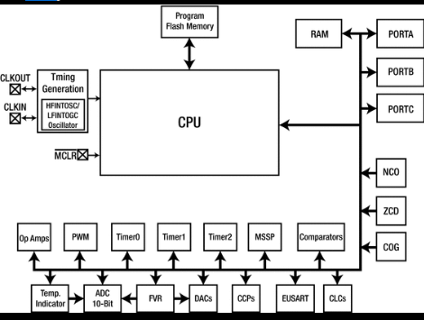
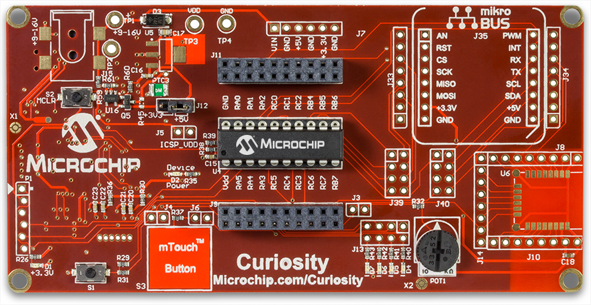
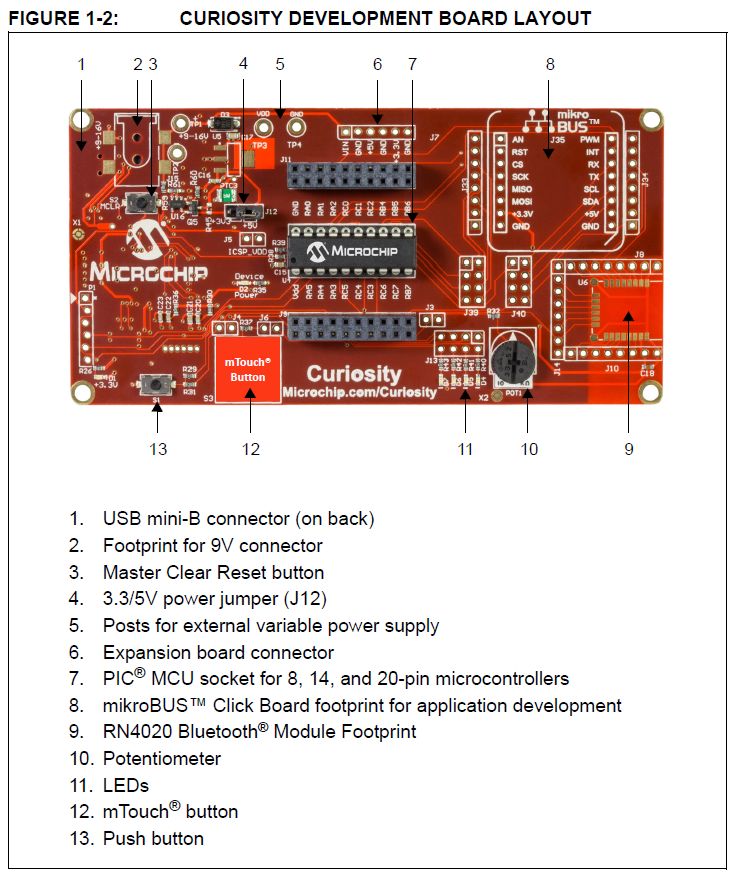
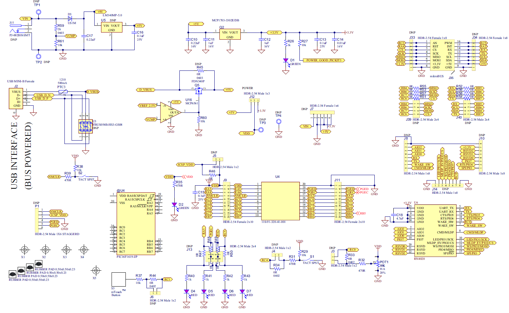

# Overview

tbd

# References

* [Wikipedia](https://en.wikipedia.org/wiki/PIC_microcontrollers)

## Hardware, Software and Kits

* [mikrolab-pic](https://www.mikroe.com/mikrolab-pic) -- full board with IDE based C compiler
* [mikroc-pic](https://www.mikroe.com/mikroc-pic) -- just the C compiler with IDE

## YouTube Refences

* [PICDEM™ Lab II Development Platform](https://www.youtube.com/watch?v=-pjT1YgeX-E&list=PL1204684BD203E0DC&index=47)

## My Other Notes

### Notes in this repository

* [ElectronicNotes](https://github.com/GitLeeRepo/ElectronicsNotes/blob/master/ElectronicsNotes.md#overview)

### Notes in Other Repositories

* [NotesGuidelines](https://github.com/GitLeeRepo/NotesGuidlines/blob/master/NotesGuidelines.md#overview)

# Contents

tbd

# Concepts and Terminology

## PIC Terminology

* **ADC** -- **analog to digital converter**.  An **onboard peripheral** an various **PIC** chips

* **ANSEL Register** -- **Analog Select Register** used to **enable/disable analog input functions on a specific pin**

* **Brown-Out Reset** -- used to **detect brownout conditions**.  It holds the **microprocessor in reset** until the **power supply** returns to an **acceptable level**.

* **CCP** -- **Capture/Compare** -- used in **timings**

* **CLC** -- **Continuous Logic Cell** -- provides **onboard sequential and combinational logic functions**

* **COG (Complimentary Output Generator)** -- takes **one PWM signal** and **converts it into two complimentary signals**

* **Core Independent Peripherals** -- require **no intervention from the CPU**

* **EUSART** -- **Enhanced Universal Synchonous Asynchronous Receiver Transmitter** -- used  for **serial communications**.

* **HFB (High Endurance Flash Block)** -- replacement from **EEPROM**.  It can **withstand more write/delete cycles** than **regular Flash**

* **INTOSC internal oscillator** -- block produces low, medium, and high-frequency clock sources. A **wide selection** of device **clock frequencies** may be derived from these **three clock sources**.: 
  * **LFINTOSC** -- **low frequency internal oscillator**
  * **MFINTOSC** -- **medium frequency internal oscillator**
  * **HFINTOSC** -- **high frequency internal oscillator**

* **I2C (Inter-Integrated Circuit)** -- a **serial protocol** that uses **frames** for communication.  Uses the **serial clock line (SCL)**  and **Serial Data Line (SDA)** for communication from the **master** to the **slave**.  Communicates at either **100kHz** or **400kHz**.

* **LAT Register** -- **Latch Register**.  If available, it is **preferable over the PORT register for output**.  It is recommended to use **PORT for input**

* **MSSP** -- **Master Synchronous Serial Port** -- provides **two modes of operation**:
  * **SPI (Serial Peripheral Interface)** function
  * **I2C (Inter-Integrated Circuit)** functions

* **NCO (Numerically Controlled Oscillator)** -- used to provide **very precise and fine resolution frequency at a duty cycle**

* **Onboard Operational Amplifiers** -- 

* **Onboard peripheral** -- **on chip independent circuits** for performing **operations outside the CPU**.  This include **ADC**, **CCP**, **PWM**, **Timers**, **Comparators**.

* **Ports** -- used to **interface** with the outside world through **pins**.  The **ports** are associated with **registers**.

* **PWM module** -- used to generate **PWM waves (Pulse Wave Modulation)**

* **SPI (Serial Peripheral Interface)** -- a type of **serial interface common on microcontrollers**.  Unlike **UART**, where very few applications require a **clock**, in **SPI** a **clock** is present in all applications since it uses **synchronous data transfer**.

* **Timers** -- used for **time measurement**, **pulse generation**, **counters**, **delays**, etc.

* **TRIS Register** -- **Tristate Register**.  It can be in one of **three states**: **output high, output low, or input**

* **Watchdog Timer (WDT)** -- automatically **resets the processor** after a given **user-defined period**.  This allows programs to **escape from endless loops** 

* **ZCD Zero Cross Detection) module** -- used to **detect when there is no voltage** on an **AC waveform**

## PIC Overview

Excerpts from [Wikipedia](https://en.wikipedia.org/wiki/PIC_microcontrollers):

**PIC** (usually pronounced as "pick") is a **family of microcontrollers** made by **Microchip Technology**, derived from the **PIC1650**.  The name **PIC** initially referred to **Peripheral Interface Controller**, then it was corrected as **Programmable Intelligent Computer**.

Early models of PIC had **read-only memory (ROM)** or **field-programmable EPROM for program storage**, some with provision for **erasing memory**. All **current models use flash memory** for program storage, and newer models allow the PIC to reprogram itself. **Program memory and data memory are separated**. **Data memory** is **8-bit**, **16-bit**, and in latest models, **32-bit** wide. **Program instructions** vary in bit-count by family of PIC, and may be **12, 14, 16, or 24 bits long**. The instruction set also varies by model, with **more powerful chips adding instructions for digital signal processing** functions.

The **hardware capabilities** of **PIC** devices range from 6-pin SMD, 8-pin DIP chips up to 144-pin SMD chips, with discrete I/O pins, **ADC** and **DAC modules**, and **communications ports** such as **UART**, **I2C**, **CAN**, and even **USB**. **Low-power** and **high-speed** variations exist for many types.

The manufacturer supplies **computer software for development known as MPLAB X**, **assemblers** and **C/C++ compilers**, and **programmer/debugger hardware** under the **MPLAB** and **PICKit** series. Third party and some open-source tools are also available. Some parts have **in-circuit programming capability**; low-cost development programmers are available as well as high-production programmers.

### Device Families

**PIC micro chips** are designed with a Harvard architecture, and are offered in various **device families**. The **baseline and mid-range families use 8-bit wide data memory**, and the **high-end families use 16-bit data memory**. The latest series, **PIC32MZ is a 32-bit MIPS-based microcontroller**. **Instruction words** are in sizes of **12-bit (PIC10 and PIC12)**, **14-bit (PIC16)** and **24-bit (PIC24 and dsPIC)**. The binary representations of the machine instructions vary by family and are shown in PIC instruction listings.

Within these **families**, devices may be designated **PICnnCxxx (CMOS)** or **PICnnFxxx (Flash)**. **"C" devices** are generally classified as **"Not suitable for new development"** (not actively promoted by Microchip). The program memory of "C" devices is variously described as OTP, ROM, or EEPROM. As of October 2016, the only OTP product classified as "In production" is the pic16HV540. "C" devices with quartz windows (for erasure), are in general no longer available.

#### PIC10 and PIC12

These devices feature a **12-bit wide code memory**, a **32-byte register file**, and a **tiny two level deep call stack**. They are represented by the **PIC10** series, as well as by some **PIC12** and **PIC16** devices. Baseline devices are available in 6-pin to 40-pin packages.

#### PIC16

These devices feature a **14-bit wide code memory**, and an improved **8-level deep call stack**. The instruction set differs very little from the baseline devices, but the two additional opcode bits allow **128 registers** and **2048 words of code to be directly addressed**. There are a few additional miscellaneous instructions, and two additional 8-bit literal instructions, add and subtract. The mid-range core is available in the majority of devices labeled **PIC12** and **PIC16**.

#### PIC17

The **17 series never became popular** and has been **superseded** by the **PIC18** architecture (however, see clones below). The 17 series is not recommended for new designs, and availability may be limited to users.

Improvements over earlier cores are **16-bit wide opcodes** (allowing **many new instructions**), and a **16-level deep call stack**. **PIC17** devices were produced in packages from 40 to 68 pins.

The **17 series** introduced a number of important new features:

* a memory mapped accumulator
* read access to code memory (table reads)
* direct register to register moves (prior cores needed to move registers through the accumulator)
* an external program memory interface to expand the code space
* an 8-bit × 8-bit hardware multiplier
* a second indirect register pair
* auto-increment/decrement addressing controlled by control bits in a status register (ALUSTA)
* A significant limitation was that RAM space was limited to 256 bytes (26 bytes of special function registers, and 232 bytes of general-purpose RAM), with awkward bank-switching in the models that supported more.

#### PIC18

In 2000, Microchip introduced the **PIC18** architecture. Unlike the 17 series, it has proven to be **very popular**, with a large number of device variants presently in manufacture. In contrast to earlier devices, which were more often than not programmed in assembly, **C has become the predominant development language**.

The **18 series** inherits **most of the features and instructions of the 17** series, while adding a number of important **new features**:

* **call stack is 21 bits wide and much deeper (31 levels deep)**
* the **call stack** may be **read and written** (TOSU:TOSH:TOSL registers)
* **conditional branch instructions**
* indexed addressing mode (PLUSW)
* extending the **FSR registers to 12 bits**, allowing them to linearly address the entire data address space
* the **addition of another FSR register** (bringing the number up to **3**)

# PIC24 and dsPIC

Refer to [Wikipedia](https://en.wikipedia.org/wiki/PIC_microcontrollers)

# PIC32M MIPS-based line

Refer to [Wikipedia](https://en.wikipedia.org/wiki/PIC_microcontrollers)

# PIC32MZ

Refer to [Wikipedia](https://en.wikipedia.org/wiki/PIC_microcontrollers)

# PIC32MM

Refer to [Wikipedia](https://en.wikipedia.org/wiki/PIC_microcontrollers)

# PIC32MK

Refer to [Wikipedia](https://en.wikipedia.org/wiki/PIC_microcontrollers)

# My Items

## Microcontrollers

### Microcontroller Classifications

Within the different **families: 8-bit, 16-bit, 32-bit)** the microcontrollers are subdivided into **classifications**.  Here are the ones for the **8-bit family**:

* **Baseline PIC microcontrollers** -- the **low end** of the scale.  They have **low pin count** and **low power requirements**. The **PIC16F57** is an example in this **classification**.

* **Mid-Range PIC microcontrollers** -- includes **more features over the Baseline**, such as **on board communications peripherals**, and the possibility of **core independent peripherals**.  The **PIC16F877**, **PIC16F84A** , **PIC16F887**are in this **classification**. 

* **Enhanced Mid-Range PIC microcontrollers** -- adds **more peripherals**, **more program memory**, along with the **C optimized architecture**. My **PIC16F1619** and **PIC16F1455** controllers fall in this **classification**.

* **High Performance PIC microcontrollers** -- these are the **highest performing** of the **8-bit PIC family**, specifically as member of the **18F family**. They include **large flash program memory**, **extended instruction set**, and **integrated protocol communications**, such as **USB**, **Ethernet**, and **CAN**.

### Diagram of a Typical 8bit Chip (PIC16F1717)

### PIC16F1619

* [PIC16F1619 Info](https://www.microchip.com/wwwproducts/en/PIC16F1619)

#### Specifications

* Program Memory Type -- Flash
* Program Memory Size (KB) -- 14
* CPU Speed (MIPS/DMIPS) -- 8
* SRAM Bytes -- 1,024
* Digital Communication Peripherals -- 1-UART, 1-SPI, 1-I2C
* Capture/Compare/PWM Peripherals -- 2 Input Capture, 2 CCP,
* Timers -- 4 x 8-bit, 3 x 16-bit
* ADC Input -- 12 ch, 10-bit
* Number of Comparators -- 2
* Temperature Range (C) -- -40 to 125
* Operating Voltage Range (V) -- 1.8 to 5.5
* Pin Count -- 20
* Low Power --Yes

### Pic16F1455-I/P Microcontroller Mcu, 8 Bit, Pic16, 48Mhz

Refer to the [Datasheet](pdf/Datasheets/PIC/PIC16F1455DataSheet.pdf)

[2X Microchip Pic16F1455-I/P Microcontroller Mcu, 8 Bit, Pic16, 48Mhz, Dip-14](https://www.ebay.com/itm/2X-Microchip-Pic16F1455-I-P-Microcontroller-Mcu-8-Bit-Pic16-48Mhz-Dip-14/253929840707?ssPageName=STRK%3AMEBIDX%3AIT&_trksid=p2060353.m1438.l2649)

#### Description

From the eBay listing

**Pic16F1455-I/P Microcontroller Mcu**, 8 Bit, Pic16, 48Mhz, Dip-14

* CPU Speed:48MHz.
* Controller Family/Series:PIC16F145x.Core 
* Size:8bit.
* Embedded Interface Type:EUSART, I2C, SPI, USB.
* MCU Case Style: DIP.
* MSL:-.
* No. of I/O's: 11.
* No. of Pins: 14.
* Operating Temperature Max:85C.
* Operating Temperature Min:-40C.
* Packaging: Each.
* Peripherals: ADC, Comparator, DAC, PWM, Timer.
* Program Memory Size:14KB.Program Memory Size:14KB.RAM Memory Size:1KB.SVHC:No SVHC (16-Dec-2013).
* Supply Voltage Max:5.5V.
* Supply Voltage Min:2.5V

From [Microchip website description](https://www.microchip.com/wwwproducts/en/PIC16F1455#additional-features):

* Enhanced Mid-range Core with 49 Instruction, 16 Stack Levels
* Flash Program Memory with self read/write capability
* 128 B of Non-volatile Data Storage
* Internal 48MHz Oscillator
* Universal Serial Bus 2.0 Module with clock recovery from USB host
* 2x Standalone PWM Modules
* 10 Channel 10-bit ADC with Voltage Reference
* 2 Analog Comparators
* 5-bit Digital to Analog Converter (DAC)
* MI2C / SPI Module
* Enhanced Addressable USART Module
* 25mA Source/Sink current I/O
* 2x 8-bit Timers (TMR0/TMR2)
* 1x 16-bit Timer (TMR1)
* Extended Watchdog Timer (WDT)
* Enhanced Power-On/Off-Reset
* Low-Power Brown-Out Reset (LPBOR)
* Programmable Brown-Out Reset (BOR)
* In Circuit Serial Programming (ICSP)
* Integrated In-Circuit Debug Circuit
* extreme Low Power (XLP) ‘LF’ Variant (1.8V – 3.6V)
* PIC16F145x (1.8V – 5.5V)

Refer to the [Datasheet](pdf/Datasheets/PIC/PIC16F1455DataSheet.pdf) for more features and details.

## Curiosity 8 Bit Development Board

**Part Number: dm164137**

Refer to:

* [Curiosity Development Board](https://www.microchip.com/developmenttools/ProductDetails/dm164137#additional-summary)
* [PDF Manual](pdf/Datasheets/PIC/Curiosity8BitDevBoardUserManual01.pdf)
* [Curiosity 8bit Dev Board video](https://www.youtube.com/watch?v=LCecexuP2fU&index=46&list=PL1204684BD203E0DC) -- YouTube

## Microcontroller Programmers

### PICKit3 Microchip Programmer

 [PICKit3 Microchip Programmer w/ USB cable, wires Pic Kit 3 and ICSP Socket](https://www.ebay.com/itm/PICKit3-Microchip-Programmer-w-USB-cable-wires-Pic-Kit-3-and-ICSP-Socket/391965539252?ssPageName=STRK%3AMEBIDX%3AIT&_trksid=p2060353.m1438.l2649) -- eBay -- 

#### Description

**PICkit3 In-Circuit Debugger/Programmer Clone** uses **in-circuit debugging logic** incorporated into each chip with **Flash memory** to provide a low-cost hardware debugger and programmer.

#### Features

* **Full-speed USB support** using Windows standard drivers
* Real-time execution
* Processors run at maximum speeds
* **MPLAB IDE compatible** (free copy included)
* Built-in over-voltage/short circuit monitor
* Firmware upgradable from PC/web download
* **Supports low voltage to 5 volts (1.8v to 5.0v range)**
* Diagnostic LEDs (power, active, status)
* Read/write program and data memory of microcontroller
* **Erase of all memory types** (EEPROM, ID, configuration and program) with verification
* Freeze-peripherals at breakpoint
* Program up to **512K byte flash** with the **Programmer-to-Go**

#### Package

* 1 x Pickit - 3
* 1x USB cable
* 1 x Ziff socket module
* 1 x set of DuPont cable

# MPLab

## MPLabExpress Cloud Based

* [mplabcloud/ide](https://mplabxpress.microchip.com/mplabcloud/ide)

# Architecture

References:

* [Begin Programming a PIC16F1xxx in C Like a Pro](https://www.youtube.com/watch?v=Lm6e3xSC8sg) -- excellent 2 hour YouTube class on programming the **PIC16F family in C**, with a lot of **architecture** related discussion.

## Ports

* **Ports** -- used to **interface** with the outside world through **pins**.  The **ports** are associated with **registers**.

## Serial Protocols

### I2C (I Squared C) -- Inter-Interface Communication

Refer to:

* [Practical I2C: Introduction, Implementation and Troubleshooting](https://www.youtube.com/watch?v=yM9OpRPMEAE) -- excellent YouTube overview

* **I2C (Inter-Integrated Circuit)** -- a **serial protocol** that uses **frames** for communication.  Uses the **serial clock line (SCL)**  and **Serial Data Line (SDA)** for communication from the **master** to the **slave**.  Communicates at either **100kHz** or **400kHz**.