# Overview

Supplement to **Transistor** section of **Great Courses Electronics** course.  This is from **other sources** than **Great Courses**

# References

tbd

## YouTube Refences

* [YouTube W2AEW](https://www.youtube.com/watch?v=c6cmkm3UPUI&t=0s&list=PLz-uMW75nraucCLdxaGyuIiIFHk8G3bzE&index=22)) -- **Class of Operation** 
* [YouTube W2AEW](https://www.youtube.com/watch?v=xR0RfmmRhDw&list=PL4ZSD4omd_Aw-ozOphzFCkhWMtBdyEIrP&index=30)* -- Transistor Current Sources

## My Other Notes

### Notes in this repository

* [ElectronicNotes](https://github.com/GitLeeRepo/ElectronicsNotes/blob/master/ElectronicsNotes.md#overview)
* [GreatCoursesNotesCh07-12](https://github.com/GitLeeRepo/ElectronicsNotes/blob/master/GreatCoursesNotesCh07-12.md#overview)

### Notes in Other Repositories

* [NotesGuidelines](https://github.com/GitLeeRepo/NotesGuidlines/blob/master/NotesGuidelines.md#overview)

# Contents

tbd

# Concepts and Terminology

tbd

# Transistor States

Mostly from **Udemy Electronics course**

At the highest level there are **two states**, with the first having **two sub-states**.  Or this can be viewed as **three states** (referred to as **operating regions**) when viewing **saturated and cutoff** separately.

* **Saturated/Cutoff** -- functions as a **switch**
  * **Saturated** -- where it is at the **max current**
  * **Cutoff** -- where the **channel** is **cutoff** through  the **emitter/collector**.

* **Active** -- functions as a **current amplifier**

The **DC operating point** is referred to as the **quiescent point**, or **Q-point**, or "bias point**.  This **point** is important when dealing with **amplification circuits**, while it is less of a factor when dealing with the **BPJ** as a **switch**.

**Class of Operation** (from: [YouTube W2AEW](https://www.youtube.com/watch?v=c6cmkm3UPUI&t=0s&list=PLz-uMW75nraucCLdxaGyuIiIFHk8G3bzE&index=22)):

* **Class A** -- **Device is on** in **active region** during the **entire waveform (360 deg)**.  Because it is on the entire time it is the least energy efficient, but it gives you the cleanest waveform.
* **Class B** --  **Device is on** for **half cycle (180 deg)**.  It is more efficient, but has more distortion, which potentially can be filtered out.
* **Class C** --  **Device is on** for **less than half cycle (\< 180 deg)**.  Even more efficient, but with more distortion.  Many **RF amplifiers** work in this region, but its too distorted for audio.
* **Class AB** -- **Device is between A and B** (\> 180 and \< 360)

# Transistor Current Flow

From **Udemy Electronics course**

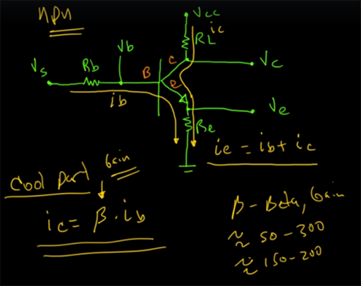 

The following shows the **current relationships in the different states**:

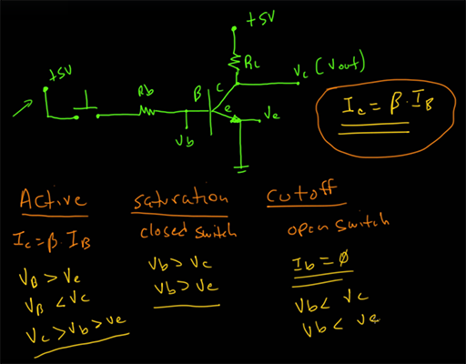 

# BPJ Bias Circuits and Beta Dependence

From: [YouTube W2AEW](https://www.youtube.com/watch?v=c6cmkm3UPUI&t=0s&list=PLz-uMW75nraucCLdxaGyuIiIFHk8G3bzE&index=22)

Image 1 of 3 below:

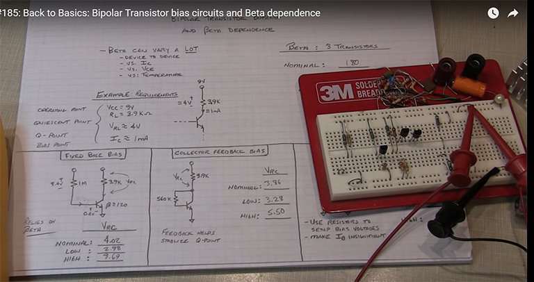 

Image 2 of 3 below:

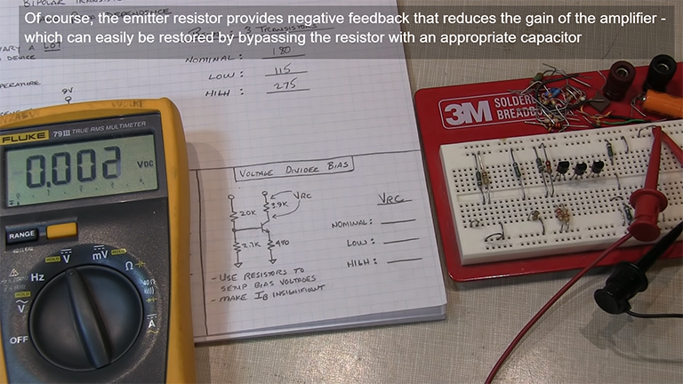 

Image 3 of 3 below:

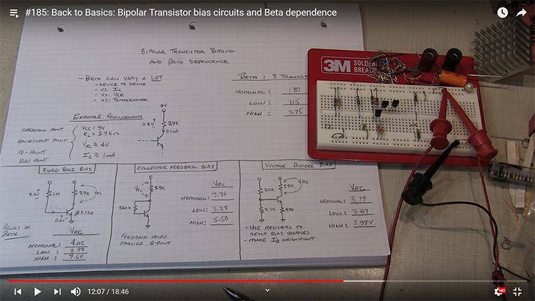 

Image 1 of 3 below:

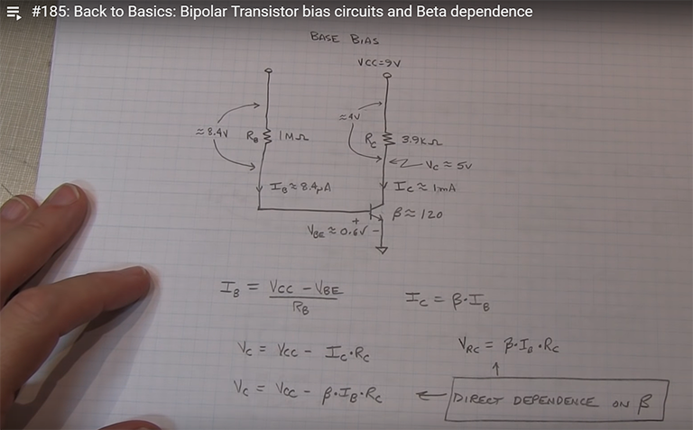 

Image 2 of 3 below (note that is B+1 in parenthesis):

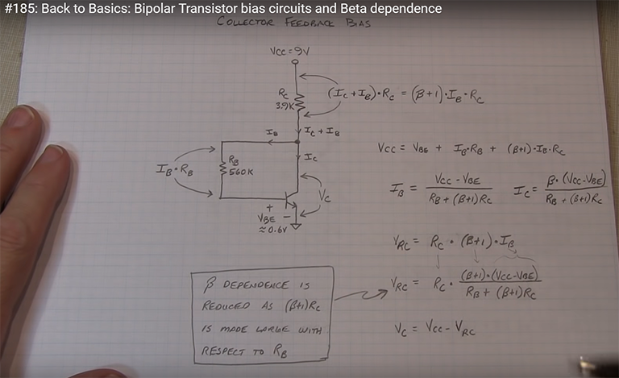 

Image 3 of 3 below:

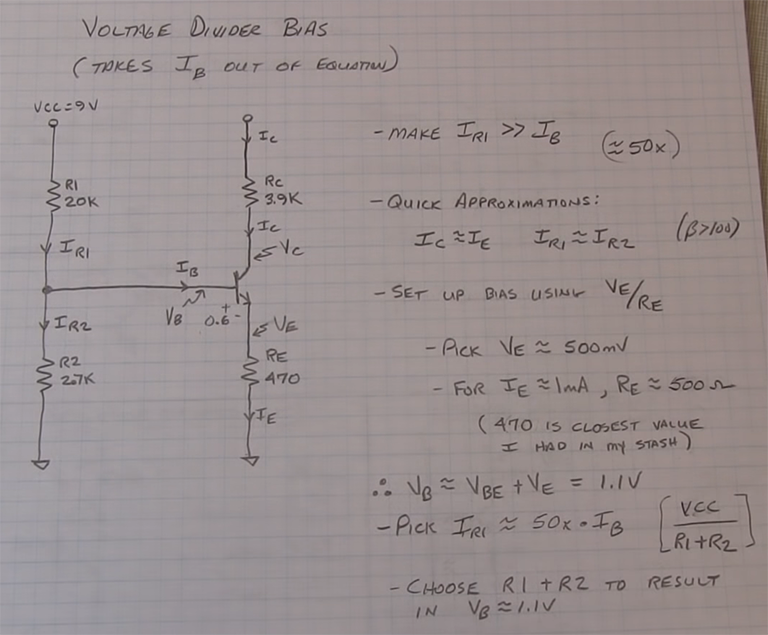 

# Transistor Current Sources

From: [YouTube W2AEW](https://www.youtube.com/watch?v=xR0RfmmRhDw&list=PL4ZSD4omd_Aw-ozOphzFCkhWMtBdyEIrP&index=30)

Image 1 of 4 below:

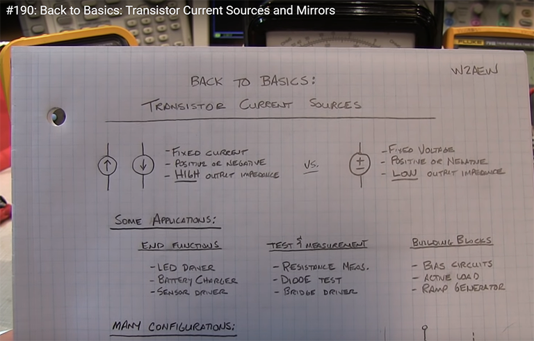 

Image 2 of 4 below (note that is B+1 in parenthesis):

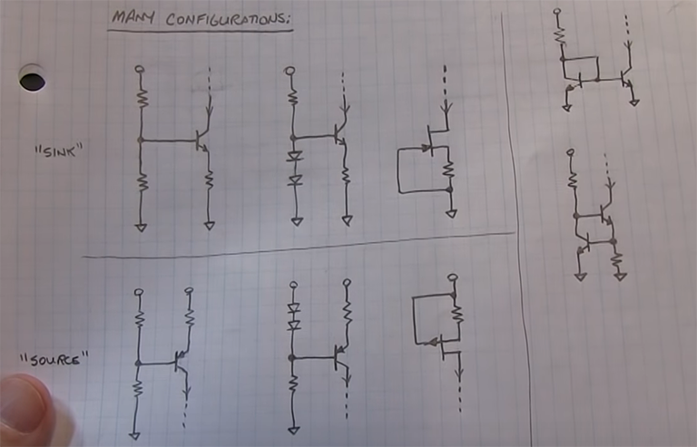 

Image 3 of 4 below:

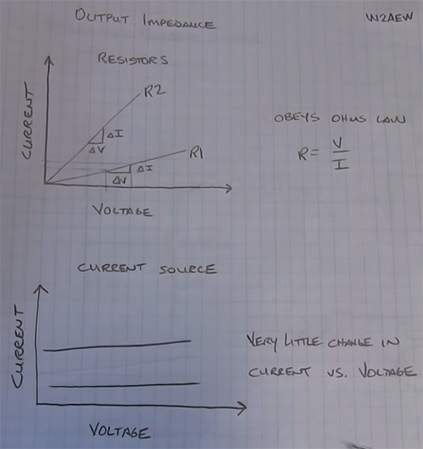 

Image 4 of 4 below:

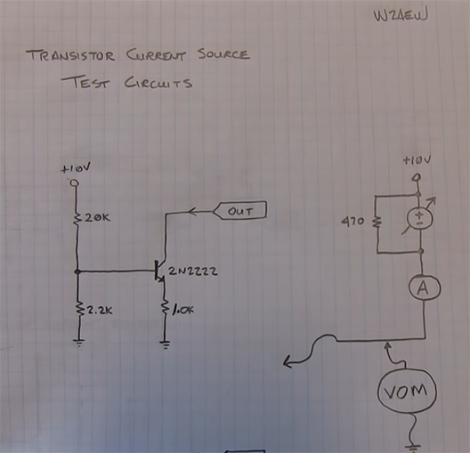 
