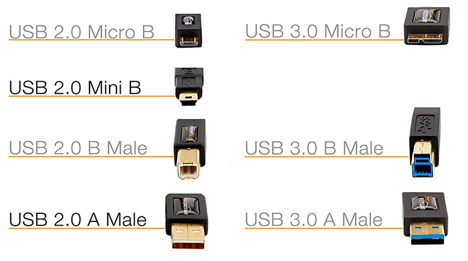
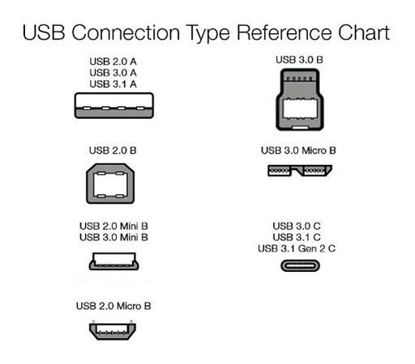

# Overview

Notes on USB 2.0 technology and Specifications.

# References

tbd

## YouTube Refences

* [USB 2.0 Embedded Host and Device Concepts](https://www.youtube.com/watch?v=Sh2rds-jiGk) -- Microchip Technology Seminar

## My Other Notes

### Notes in this repository

tbd

### Notes in Other Repositories

* [NotesGuidelines](https://github.com/GitLeeRepo/NotesGuidlines/blob/master/NotesGuidelines.md#overview)

# Contents

tbd

# Concepts and Terminology

tbd

# USB 2.0 Basic Concepts

The **Universal Serial Bus (USB)** is a cable **bus** with a **single master (the host)** and **multiple peripherals (the devices)**

* Easy to **expand** via **hubs**

* **Standardization** via **USB Implementors Forum (USB-IF)** [www.usb.org](https://www.usb.org/)

* **USB** uses a **tiered star topology** with **tier 1** being the **root hub**

* Every **device** gets a **unique address** between **1 and 127** assigned by the **host**

* Every **device** needs a **unique pair of IDs**.  This includes the **Vendor Id (VID)** and a **Product ID (PID)**

**USB** offers **two types of devices**

* **Hub** -- expands the **bus** by adding more **ports**

* **Function** -- offers **communication** capabilities with **devices** (keyboards, mouse, printers, etc)

## USB Connectors

### USB Wires

**USB** uses **four wires**

* **D+** -- for **data**
* **D-** -- for **data**
* **Vbus @ 5V** -- for **power**
* **GND** -- for **ground**

## USB Power

A **device** can be:

* **Bus powered** -- if **sinking current** (Up to **500mA** after **enumeration**) from **Vbus only**.
* **Self powered** -- if **sinking current** from **Vbus** (up to **100mA**) and an **external power supply**

It is typical to **only draw current** from the **external power supply**, although you still want the **connection to the Vbus power**

The **device** goes into **suspend mode** (2.5mA from Vbus) to **save power** if the **bus** is **idle more than 3ms** and **resumes following bus activity**.

# Traffic on the Bus

# Device Enumeration

# Windows Drivers

# Device Certification

