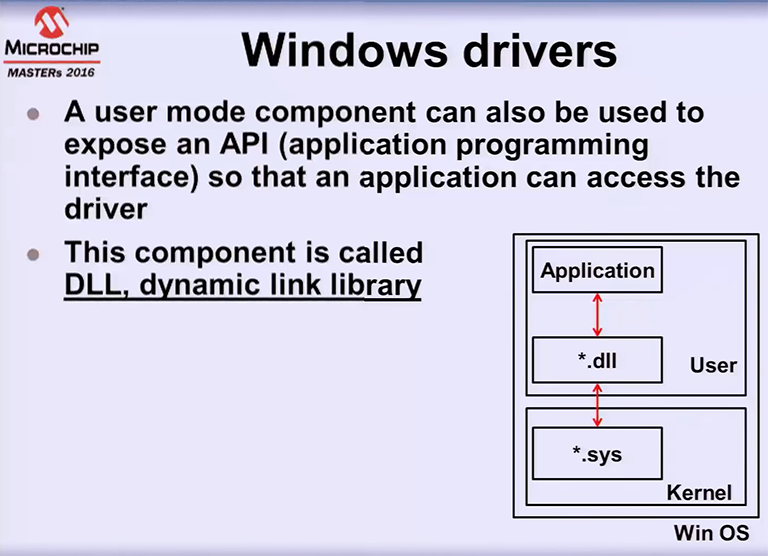
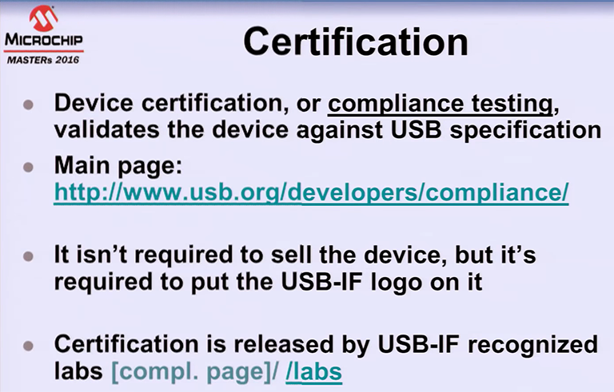

# Overview

Notes on USB 2.0 technology and Specifications.

# References

tbd

## YouTube Refences

* [USB 2.0 Embedded Host and Device Concepts](https://www.youtube.com/watch?v=Sh2rds-jiGk) -- Microchip Technology Seminar
* [USB 101](https://www.youtube.com/watch?v=5S6ZPmtPzRA) -- Silicon Labs presentation -- short but good overview

## My Other Notes

### Notes in this repository

* [USB Hubs and Cable Lengths](https://github.com/GitLeeRepo/ElectronicsNotes/blob/master/USB_HubsAndCableLengths.md#overview)
* [ElectronicNotes](https://github.com/GitLeeRepo/ElectronicsNotes/blob/master/ElectronicsNotes.md#overview)
* [PICNotes](https://github.com/GitLeeRepo/ElectronicsNotes/blob/master/PICNotes.md#overview)
* [PICArchitectAndAssemblyNotes](https://github.com/GitLeeRepo/ElectronicsNotes/blob/master/PICArchitectAndAssemblyNotes.md#overview)

### Notes in Other Repositories

* [NotesGuidelines](https://github.com/GitLeeRepo/NotesGuidlines/blob/master/NotesGuidelines.md#overview)

# Contents

tbd

# Concepts and Terminology

* **Bulk Transfer Type** -- includes **Mass Storage device** and **Communication Device Class (CDC)**.  It has **high throughput**, but **low priority**.  It provides **guaranteed delivery with error checking**.
* **Cable Lengths** -- **5 meters** is the maximum USB cable
* **Descriptor** -- a **structure** in the **firmware** that contains **USB Information**, such as what **type of device** and what **interfaces it supports**.
* **Device** -- also called **peripheral** is the **slave device** that connects to the **host**.
* **Enumeration** -- the **handshaking** process **between device and host**. The **beep** you hear in **Windows** is the begining of the **enumeration process**
* **Frame** -- **time based grouping** with **fixed timing**. It is the **basis of all USB communication**.  It is made up of **multiple packets**.
* **Host** -- the organizer and **master** of all **traffic on the bus**
* **Hub** -- **expands the number of devices** that can attach to a **host**, along with acting as a **repeater** extending the distance to the device. There is a **maximum of 5 hubs** serially chained together, with a **maximum of 5 meters between each**
* **In transfer** -- moves from the **device to the host**
* **Interrupt Transfer Type** -- **low throughput** with **high priority** and **guaranteed latency**.  It includes **Human Interface Devices (HID)** such as **mouse** and **keyboard**.
* **Isochronous Transfer Type** -- used for **audio** and **video**.  It provides **no guarantee of delivery** with **high throughput**.  Used when **dropped packets** are **not critical**.
* **OTG** -- **On the Go** -- allows **USB devices**, such as tablets or smartphones, to **act as a host**, allowing those devices to **switch back and forth** between the roles of **host and device**.
* **Out transfer** -- moves from the **host to the device**
* **Packet** -- a bundle of **data** organized into a **group for transmission**.
* **Root Hub** -- the **base hub** on the **host** that all **devices** and **additional hubs** attach to.
* **USB** -- **Universal Serial Bus**.

# General USB

## USB Hubs and Cable Lengths

Refer to:

* [USB Hubs and Cable Lengths](https://github.com/GitLeeRepo/ElectronicsNotes/blob/master/USB_HubsAndCableLengths.md#overview)

* **Cable Lengths** -- **5 meters** is the maximum USB cable
* **Hubs (Maximums)** -- There is a **maximum of 5 hubs** serially chained together, with a maximum of **5 meters between each**

# USB 2.0 Basic Concepts

The **Universal Serial Bus (USB)** is a cable **bus** with a **single master (the host)** and **multiple peripherals (the devices)**

* Easy to **expand** via **hubs**

* **Standardization** via **USB Implementors Forum (USB-IF)** [www.usb.org](https://www.usb.org/)

* **USB** uses a **tiered star topology** with **tier 1** being the **root hub**

* Every **device** gets a **unique address** between **1 and 127** assigned by the **host**

* Every **device** needs a **unique pair of IDs**.  This includes the **Vendor Id (VID)** and a **Product ID (PID)**

**USB** offers **two types of devices**

* **Hub** -- expands the **bus** by adding more **ports**

* **Function** -- offers **communication** capabilities with **devices** (keyboards, mouse, printers, etc)

## USB Connectors

### USB Wires

**USB** uses **four wires**

* **D+** -- for **data**
* **D-** -- for **data**
* **Vbus @ 5V** -- for **power**
* **GND** -- for **ground**

## USB Power

A **device** can be:

* **Bus powered** -- if **sinking current** (Up to **500mA** after **enumeration**) from **Vbus only**.
* **Self powered** -- if **sinking current** from **Vbus** (up to **100mA**) and an **external power supply**

It is typical to **only draw current** from the **external power supply**, although you still want the **connection to the Vbus power**

The **device** goes into **suspend mode** (2.5mA from Vbus) to **save power** if the **bus** is **idle more than 3ms** and **resumes following bus activity**.

## USB Data

### USB Data Rates

**Three bit rates over D+ and d-**:

* **Low Speed (LS)** -- **1.5Mb/s** -- supported on **8/16/32 bit PIC microcontrollers**
* **Full Speed (FS)** -- **12Mb/s** -- supported on **8/16/32 bit PIC microcontrollers**
* **High Speed (HS)** -- **480Mb/s** -- Only supported on **32bit PIC microcontrollers**

Note that the **actual data transfer rate** is **less than bit rate** because of **protocol overhead** and **bus sharing**.

**Hubs** separate **LS/FS** from **HS** using **split transactions**

### USB Data Buffers

A **device** uses **data buffers** called **endpoints (EP)**

* **Output EP** used to **store data received from the host**
* **In EP** used to **store data sent to the host**

Every **device** has an **EP0 in** and an **EP0 out** used during **enumeration**

**Non-zero EPs** are grouped into **interfaces** which are accessible **after enumeration** and are used for **communications**.

### USB Transfer Types

The **host** exchanges **data** with the **devices** using different **transfer types**:

* **Control** -- used by the **host** during **device configuration** rather than during the actual **communication**
* **Interrupt** -- used for **communications** when **latency matters**
* **Bulk** -- used when **throughput matters**
* **Isochronous** -- typically used with **real time communications**, such as **streaming applications**.  There is **no error correction**

In most cases you will use either **Interrupt** or **bulk transfers**

### USB Classes

The **USB-IF** defines **device topologies** or **classes** based on **transfer types**.  The **most common classes** include:

* **HID** -- **Human Interface Device** which uses an **interrupt transfer type** -- a **keyboard or mouse** are examples.

* **MSD** -- **Mass Storage Device** which uses a **bulk transfer type** -- **hard drives** and **USB thumb drives** are examples.

* **CDC** -- **Communication Device Class** -- uses both **interrupt** and **bulk transfer types** -- used as an **RS232 replacement** -- used in **USB to UART bridges** which creates **virtual COM ports**

# Traffic on the Bus

**Protocol analyzers** are tools that can be used to **monitor traffic on the bus** between the **host** and the **device** to **capture traffic** and **display it in a GUI**.

**Packet Types**:

* **Token** 
  **In, OUt, Setup** to **start a transaction**
  **SOF (Start of Frame)** used as a **time based keepalive** on the **bus**
* **Data**
  * **Data0** and **Date1** are **alternated during a transfer**
* **Handshake**
  * **ACK, NAK, STALL** to report the **outcome of a transaction**
* **Special for High Speed**
  * **SSPLIT, CSPLT** used for **split transactions**
  * **PING, NYET** used for **bulk transfers**

**Token, Data, and Special Packets** have a **CRC check**, with the exception of **NYET** with **mismatches ignored by the receiver**

# Device Enumeration

## Device Enumeration Descriptors

# Windows Drivers

## Kernel Mode

## User Mode

## INF File

# Device Certification

